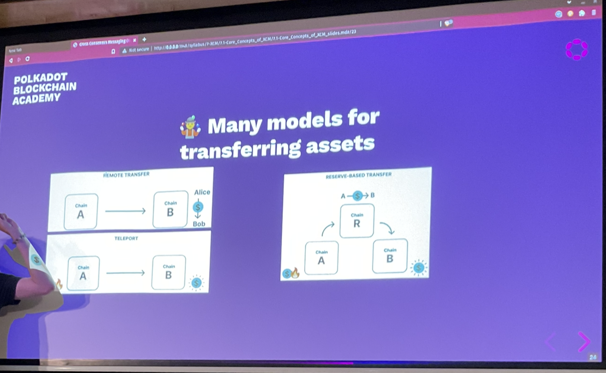

# XCM

Cross chain messaging.

A message format between two consensus systems.

## Concrete use Cases

- Cross-consensus asset transfer
- Execute platform-specific actions (extrinsics) such as governance voting
- Enabling single use-case chains e.g. Statemine/Statemint as asset parachains
  - There will soon be a governance parachain which is only concerned with governance.

## Cross Consensus?

- Can be any programmatic state-transition system that exists within consensus which can send/receive datagrams.
- It does not even have to be a distributed system, only that it can form some kind of consensus.

## A Format, not a Protocol

XCM is a messaging format.
- It is akin to the post card from the post office. It is *not* a messaging protocol!
- A post card doesn't send itself.

In XCM, we are talking only about the contents of the postcard, not how it is sent.

## Why not **native** messages?

Drawbacks of relying on native messaging or transaction format:
- Lack of uniformity between consensus systems on message format
- Common cross-consensus use -cases do not map one-to-one to a single transaction
  - XCM makes it possible to contain multiple specific instructions, that allow what would be done in multiple transactions to be expressed in a single message.
- Operations on consensus systems have different assumptions e.g. fee payment

## XCM Versioning

Based on the upcoming XCMv3

Most XCM can be auto-converted to the next version, but some require manual involvement.

Every release only supports 2 versions: previous and current

## XCM Versioning

Based on the upcoming XCMv3

Most XCM can be auto-converted to the next version, but some require manual involvement.

Every release only supports 2 versions: previous and current
- This means old ones must be dropped. We expect roughly 6 monthly upgrades

## Locations in XCM

`MultiLocation` = a **relative** location in the consensus multiverse.

All entities are addressed as paths to them, *relative* to the current consensus system.

```rust
pub struct MultiLocation {
  pub parents: u8,
  pub interior: Junctions,
}
```

## Junction

Similar to a file path, but for the location of something in a consensus system.

A single item in a path to describe the relative location of a consensus system:
- Parachain
- AccountId32
- PalletInstance
- GeneralKey

## Junctions* (with an s)

Enum containing multiple `Junction`s:

```rust
enum Junctions {
  X1(Junction),
  X2(Junction, Junction),
  X2(Junction, Junction, Junction),
  // ...
  X8(Junction, ...),
}
```

We don't use arrays, because all the empty space always gets encoded, this would bloat it, hence we use enums instead.

### MultiLocation Examples

- `../Parachain(1000)`: Evaluated within a parachain, this would identify our sibling parachain of index 1000.
- `../AccountId32(0x3452...sdf)`: Evaluated within a parachain, this would identify the 32 byte account on the relay chain.
- `Parachain(42)/AccountKey20(0x1234...abcd)`: Evaluated on a relay chain, this would identify the 20-byte 0x1234...abcd account on parachain 42 (presumable something like Moonbeam which hosts Ethereum-compatible smart contracts)

## Construct a `MultiLocation`

1. What is *your* location?
2. Where do you want to send to?
3. Write you `MultiLocation`

## Cross-Consensus Accounts - Sovereign Account

Within a consensus system, an account which belongs to another consensus system
```
encoded_bits = encoded(b"para") ++ encoded(ParaID) ++ 000000...
```
Keith (lecturer) skipped this slide because it was confusing.

## Cross-Consensus Origin

A `MultiLocation` denoting where an XCM originated from

- *Relative* to the current location
  - Can be converted into a pallet origin in a FRAME runtime
- Used for access control

## MultiLocation established!

Now we know how to describe the destination, what do we want to send?

Let's start with messages (XCVM Programs!) about **assets**.

There are many *classes* of assets (fungible, NFTs, ...)

## Asset Representation

```rust
struct MultiAsset {
  pub id: AssetId,
  pub fun: Fungibility,
}

// Concrete located e.g. DOT/native tokens - these are represented by a multi location
// Abstract assets such as UST. -> stored on another network
enum AssetId {
  Concrete(MultiLocation),
  Abstract([u8; 32]),
}

// Specifies whether your asset is fungible is not
enum Fungibility {
  Fungible(u128), // u128 represents how much of that asset you contain
  NonFungible(AssetInstance), // here we use an AssetInstance to represent that asset
}

// These are different lengths of an array you can use to identify your asset
// e.g. first 2 bytes to identify the collection, and the following bytes to identify the specific asset
// this is configurable per NFT
enum AssetInstance {
  Undefined,
  Index(U128),
  Array4([u8; 4]),
  Array8([u8; 8]),
  Array16([u8; 16]),
  Array32([u8; 32]),
}
```

## Convenience methods to create `MultiAsset`

```rust
// Creates 10 billion units of fungible native tokens
let fungible_asset: MultiAsset = (Here, 10_000_000u128).into()

// Creates an abstract NFT with an undefined asset instance
// (asset_id, asset_instance)
let nft_asset: MultiAsset = ([0; 32], ()).into();
```

## Asset Wildcards and Filters

```rust
enum WildMultiAsset {
  All, // all assets contained within a multi-location
  AllOf { id: AssetId, fun: WildFungibility }, // all of this kind of asset id
  AllCounted(u32), // specify the upper limit of how many assets 
  AllOfCounted { id: AssetId, fun: WildFungibility, count: u32 }, // specify the upper limit of assets you want to select
}

// More concise way of representing whether or not an asset is fungible
enum WildFungibility {
  Fungible,
  NonFungible,
}

// Important to know how much of an asset to require
// This works as a filter
enum MultiAssetFilter {
  Definite(MultiAssets),
  Wild(WildMultiAssets),
}

// We can use this for just MultiAssets
struct MultiAssets(Vec<MultiAsset>);
```

## Re-anchoring

`MultiLocations` are relative.

Scenario;
Current consensus system is `Para(1337)`. Destination consensus system is `Para(6969)`.
- Where is `Here`?
- What happens when I send a `MultiAsset` with an `AssetId` of `Concrete(Here)` to `Para(6969)`.

Re-anchoring happens on execution of your XCM.

Usually it is not responsible for re-anchoring, it is the responsibility other XCM executor.

## Many models for transferring assets

1. "Remote control" an account on another system (not really transfers assets, but kinda)
2. Reserve backed asset transfers
3. Teleport transfers



Teleportation asset transfer requires a huge amount of trust. How do you know the other chain will comply, they could have lied about burning their assets, or the other chain may not mint them.

XCM assumes the message will arrive. If it doesn't there could be a loss of funds.

Reserve based transfers is more common than asset teleportation. There are actually 3 actors. Chain A&B and don't trust each other. So they are going to use a trust worthy intermediary (the Reserve chain). All the real assets are contained within the reserve.

## The XCVM

At the cor of XCM lies the **Cross-Consensus Virtual Machine (XCVM)**.

A "message" in XCM is an XCVM program.

The XCVM is a state machine, state is kept track in **Registers**.

- You can think of messages in XCM as programs in and of themselves.
- A Register is a field within an XCM executor.
- XCM messages are highly dependent on how the recipient interprets the message, this is dependent on the XCVM.
- You can extend the executor to do more instructions.

## XCVM Instructions

These might change a register, they might change the state of the consensus system or both.

One example of such an instruction would be `TransferAsset` which is used to transfer an asset to some other address on the remote system. It needs to be told which assets(s) to transfer to whom/where the asset is to be transferred.

```rust
enum Instruction {
  TransferAsset {
    assets: MultiAssets,
    beneficiary: MultiLocation,
  }
  // ....
}
```

- With transfer asset there is a holding register

## XCVM Instructions preview

Four kinds of instructions:
- Instruction
- Trusted Indication
  - Saying that you have burned some tokens
  - `ReserveAssetDeposited` - in the reserve system, chain R sends this to chain B
- Information
  - Something that reports the local state of the requestor
- System Notification
  - XCM and XCMP are different things totally. A System Notification is trying to convey events from the underlying messaging system.
  - You might want to notify recipients that a channel has indeed been opened.

## XCVM Registers

- Registers are the state of XCVM
- Note that XCVM registers are temporary/transient

```rust
pub struct XcmExcutor {
  holding: Assets,
  holding_limit: usize,
  context: XcmContext,
  original_origin: MultiLocation, // this is a register that is the privilege level
  trader: Config::Trader,
  error: Option<(u32, XcmError)>, // u32 represents the index for the instruction that failed
  total_surplus: u64,
  total_refunded: u64,
  error_handler: Xcm<Config::Call>,
  error_handler_weight: u64,
  appendix: Xcm<Config::Call>,
  error_handler_weight: u64,
  appendix: Xcm<Config::Call>,
  appendix_weight: u64,
  transact_status: MaybeErrorCode,
  fees_mode: FeesMode,
  topic: Option<[u8; 32]>,
  _config: PhantomData<Config>,
  ...
}
```

## The Holding Register

`WithdrawAsset` has no location specified for assets.
They are *temporarily* held in the Holding Register.

This is temporarily holding the assets that is going to be used in later instructions while you are executing your XCM.

```rust
WithdrawAsset(MultiAssets),

// There are a number of instructions
// which operate on the Holding Register.
// One very simple one is the `DepositAsset` instruction.

enum Instruction {
  DepositAsset {
    assets: MultiAssetFilter,
    max_assets: u32,
    beneficiary: MultiLocation,
  }
  // ...
}
```

The XCVM is not part of FRAME, it is not a pallet, is a rust module.
The XCM pallet offers the option of specifying what your XCM executor is.

Everything regarding XCM is dependent on FRAME. The only link you have between XCM and FRAME is the XCM pallet.

Within the XCM executor you can specify exactly what kind of code is responsible for depositing assets or withdrawing assets (normally a pallet e.g. the assets pallet).

When you are talking about how you are going to know if it will get included in the block, that is the responsibility of the asset transactor.

## Key configurable XCM

You really must have these:
- Barrier
  - The firewall for your XCM
  - Decided whether something should be executed or not
- WeightTrader
  - Used to convert weight units into an asset that you can pay for.
- XcmSender
  - The XCM executor has the specify what the XcmSender is to correctly route messages
- OriginConverter
  - Converts a MultiLocation to a runtime origin or vice versa.
- AssetTransactor
  - Here you would put in the assets or the balances pallet.

There are more configurable items, the above are just the most important worth mentioning.

### Barrier

Specifies whether or not an XCM is allowed to be executed on the local consensus system. It is highly important that we configure this barrier correctly, or you become vulnerable to attack.

If you do not configure it, other chains could send you XCM messages without paying any fees. You could get DOSed

### XcmSender

Specifies the message passing protocol that the XCM executor uses to send the XCMs.

It tries to take your MultiLocation and route your message to the correct location.

I wanna use XCMP to communicate with other parachains. I then also want to use UMP to communicate specifically with the relay chain.

UMP - upward message passing.
DMP - downward message passing.

## Fee payment in XCM

Most systems require these to mitigate "transaction spam" and a DOS attack.

XCM does not include the idea of fees and fee-payment as a first-class citizen.

When you are trying to send an XCM message from a relay message to a common good parachain, it doesn't make sense to collect fees for that kind of transaction, as both chains trust each other (they know they are not spamming one another).

In general the use of fees in XCM is a good way to ensure that they are not overused.

XCM messages are calling the functions directly in your chain, not using the extrinsics, hence you need to protect your chain.

## XCM with Fees Example

```rust
WithdrawAsset((Here, 10_000_000_000).into());
ByExecution {
  fees: (Here, 10_000_000_000).into(), // MultiAsset
  weight: 3_000_000, // u64
},
DepsitAsset {
  assets: All.into(), // MultiAssets
  max_assets: 1,
  beneficiary: Parachain(1000).into(), // MultiLocation
},
```

## Next steps

1. Gav's blog series introducing XCM: Parts 1, 2 and 3.
2. XCM Format repository

## Glosarry

- UMP - Upward Message Passing - allows parachains to send messages to the relay chain
- DMP
- HRMP - Horizontal Message Passing
- XCM
- XCVM
- XCMP (Cross-Consensus Message Passing)

## Questions

Why do you need a consensus specific messaging format? Are you dealing with certain constraints?
- We are in the blockchain world, every blockchain has a size limit. JSON is quite heavy. There are things that you want to communicate between blockchains, BSON is a bit too broad. It is not really catered to our use cases. You could use BSON, but it is going to be a bit more verbose than a messaging standard that designed specifically for this use case.


