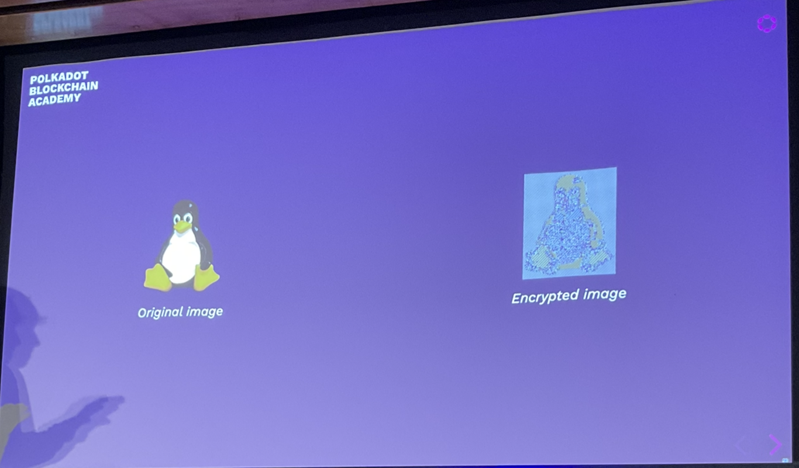

# Intro to Cryptography

## Goals

- Understand the goals of cryptography
- Understand network and contextual assumptinos
- Learn what expectations cryptography upholds
- Learn the primitives

## Operating Context

The internet is a public space.
Currently you can not assume communication is safe.
You may trust the third parties, but can you really?
They could:
- Read messages not intended for them
- Impersonate others
- Tamper with messages

We want to make that impossible.

## Operating Context

- Network resources
- Privacy

## Open vs Closed Channels

**Kerckhoff's Principle** - Security should not rely on secret methods but rather on secret info.
Public security is safer.

## Data Accessibility

The ability to read data.
You can add restrictions on data access.
It is inaccessible unless they have the key.

story - company wanted a turnkey solution where the ceo had access and the general counsel. The problem was that they used microsoft software, not only the CEO and counsel had access on a technical level, so did the sys admin. Hence the info could not be placed under attorney client privilege and could be used legally.

This is serious legal stuff. - real legally ramifications. If you show it to anyone other than the attorney, then the government can subpoena it so it can be seen in court.

## Message Authenticity

Checking that if a message arrives, it came from the expected entity. For now we are saying an identity is a digital value that can be represented. It is a credible guarantee. There are no absolute guarantees.

## Data Integrity

The other side of message authenticity, the data is unchanged. It has not been tampered with.

E.g. when you get a certificate, it has not had the name or grade updated.

## One-Way Functions

The basis of cryptography - cryptographic hashing and asymmetric encryption. It cannot be reversed easily.
- Fast algorithm to compute
- We believe they hard to invert (exponential time)
- There may be some secret which makes it easy

## Hash Functions

A succinct representation of a data gram. A fingerprint.

Cryptographic hashing has different guarantees to the more traditional comp sci hashing algorithms. You usually cannot use a random seed. You can use a random seed on your local machine because it is irrelevant outside of your machine. You can add an additional random input that makes it essentially indeterministic.

This is not the same for cryptography.

## Hash Function Applications

Hashes can be useful for many applications:
- Representation of larger data object (history, commitment, file)
- Keys in a database
- Digital signatures
- Key derivation
- Pseudorandom functions

## Hash Function Properties

1. Accept unbounded size input
2. Map to a bounded output
3. Fast to compute
4. Computable strictly one-way (difficult to find a pre-image for a hash)
5. Resist pre-image attacks (attacker controls one input)
   - You have a fixed output. e.g. all zeroes. 32 bytes output for any size input.
   - You shouldn't be able to workout what the input should be for this.
6. Resist collisions (attacker controls both inputs)

The bitcoin network uses nakamoto consensus, proof of work consensus. The puzzle that needs to be solved is a partial pre-image attack. The bitcoin consensus algorithm is the outcome of trying to attack a particular consensus algorithm. SHA-256 secure hashing algorithm (256 bits). You have to find the input such that the output is all zeroes. You only have to find some number of leading zeroes (hence it is a partial pre-image attack).

If you have x bytes, and x*y. The set of possible outputs is smaller than the set of possible inputs.

## Hash Function


## Input Sensitivity

50% change of every bit in the output flipping.
So say you change a single comma in a long string, the output is totally different.

## Cryptographic vs Non-Cryptographic

Non-cryptographic functions are about an order of magnitude faster.

Famous ones:
- xxHash (non-cryptographic function) - fastest decent non-cryptographic
- MD5 (insecure)
- SHA1
- RIPEMD-160 (used for bitcoin address hashing) - 20 bytes, length of bitcoin address hash
- SHA2-256 etc. (2 represents it being the second implementation)
  - Bitcion
  - This is more of a standard than an actual implementation
  - This is often misstated as SHA-256
- SHA3
  - Came out recently
    - Questions around if the this was made less secure than the Keccak algorithm
- Keccak
  - Ethereum default
  - Very similar to SHA3
- Blake2
  - There is a Blake3 but it's not that much better.
  - Polkadot uses this

TwoX64 is about 20x faster


Web2 revolves around ssl.

There is no memory in crypto systems. The references/hashes are the references. No central understanding of a machine or memory. These have a big impact on performance. These algorithms are deeply integral to the data structures in a blockchain.

## How to choose hash functions

- Have not found a situation where blake 2 is significantly worse
- Compatibility vs speed
- Every time you are creating a new system

## Hashing some data using rust

- in evxcr repl

```rust
:sccache 1
:dep sp-core = { git = "https://github.com/paritytech/substrate", branch = "polkadot-v0.9.25" }
use sp_core::*;
use hexdisplay::*;
HexDisplay::from(&[0, 1, 2, 3, 4])
HexDisplay::from(b"ABCDE")
HexDisplay::from(&twox_64(&b"Polkadot Academy 2022"[..]))
HexDisplay::from(&twox_64(&b"Polkadot Academy 2023"[..]))
// blake 2 - this is now more cryptographically secure
// 128 bit is not considered secure nowadays
HexDisplay::from(&blake2_128(&b"Polkadot Academy 2022"[..]))
```

If you put the same input in, you get the same output out. There are non-deterministic hash functions. Crucially all cryptographic functions are deterministic. It is a pure function.

## Symmetric Encryption


E.g 
- modern:
  - ChaCha20
  - Twofish
  - Serpent
  - Blowfish
- AES (serious concerns about AES)
- DES (digital encryption standard, used in legacy systems)
- XOR

### XOR Cipher

The encryption and decryption functions are identical: applying a bitwise XOR operation with a key.

```
Plane: 1010 -->Cipher: 0110
Key:   1100  |         1100
       ----  |         ----
       0110--^         1010
```

If you know you both have the key and no one else does, and the entropy content of the key is at least as good as the information you are trying to share then you can have perfect secrecy.

This works for one time passwords. Nuclear submarines use 1 time passwords - it doesn't matter that they key is as trivial as XOR, as the key has as much entropy as the information to be encoded.

**LESSON: The key is important, the cipher just needs to be secure**

Usually the key is smaller.

Introducing a key means you have a scalable security.

You can share information publicly without anyone else knowing what we mean - due to us having a shared secret.

## Symmetric Encryption Warning

We typically expect symmetric encryption to preserve little about the original plaintext. Do not try and write these algorithms yourself. Use peer reviewed algorithms.

Examples of it going wrong:
- Unsalted password and the ECBpenguine.

Block cyphers, take a bloc of information of size x, XOR it with x amount of information, and then output a block of size x.

"Encrypted penguin:"


You need some information from the previous block to ensure that patterns are not visible, to prevent the above problem.

## Asymmetric Cryptography

- Transform secret key into public key, preserving certain properties.
- One-way function (no easy/fast inverse function)
- Public key reveals no info about the secret
- Using only the *public key* information can be transformed/encrypted such that only those with knowledge of the secret are able to inverse and regain the original information.
- Using the *secret key*, information can be transformed "signed" such that anyone with knowledge of the information and the counterpart public key are able to affirm the operation.

The secret should be able to be even memorised in human memory. Every secret has a derivable counterpart - public key.

Can take the secret and easily transform it into the public key, but it is hard to do the opposite.

These are called key pairs - the encryption key and decryption key.
- If you know the decryption key you know encryption key, but not vica versa.

## Asymmetric Protocols

- **RSA**
  - this is the grandaddy
  - was patented
  - PGP (pretty good privacy) then GPG
- **Elgamal**
- **Elliptic Curve**
  - **ECDSA (SECP256k1, SECP256r1)**
    - *SECP256k1*
      - The numbers and parameters are as small and as simple as could satisfy the requirements of making the algorithm secure. More trustworthy.
    - SECP256r1
      - Selected by the US government
      - The curve is defined by a few parameters, SECPr = "secure eliptic curve parameters randomly selected". The NSA selected these parameters.
        - Did they actually choose parameters such that their cryptographers can crack it.
        - The NSA has been caught intentionally weakening algorithms before?
  - **Schnorr**
    - Name ofa guy
  - **EdDSA (Ed25519, Ed448)**
    - Uses Schnorr like functionality (more secure and faster)
    - Modern/new projects tend to do this.
    - Uses the edward set of curves.
  - **Schnorr/Ristretto 25519** (SR25519)
  - **BLS**
    - Slower but has interesting properties
- ECC require double the bits to the  symmetric AES for the same level of security e.g. 128 bit security requires a 256 bit ECC key.

## Practical Considerations

- Symmetric Cryptography
  - Faster
  - Requires more setup (key estabilshment) adn trust - someone else knows the secret
- Asymmetric
  - Introduces public key capabilities

## Hybrid Cryptography

Hybrid mixes symmetric and asymmetric cryptography.
- symmetric encryption provides speed and confidentiality
- Asymmetric can dictate relations among the participants.

## Digital Signatures

Provide message authenticity and integrity guarantees.

- **signing function:** pure function which operates on some message of data and some secret to yield a signature.
- A **signature** proves that the signer had knowledge of the secret without revealing the secret itself.
  - The signature cannot be used to create other signatures.

Secrets are identified not by their actual data (which we assume only the signer knows) but rather a derivative counterpart (public key) which maps 1:1 with the secret (and so can be used to identify it), yet does not compromise it.

We don't use a hash function to do this. We use the counterpart and the has of the counterpart (often hashed twice with two different hashing algorithms).

## Digital Signatures on Plaintext

E.g. affirmation of a document's author.

## Questions

Does hash algorithm choice have a big impact on blockchain performance.
What do we mean by multiple inputs into a hashing algorithm.
What tools other than cryptography allow us to make those guarantees of safety?


