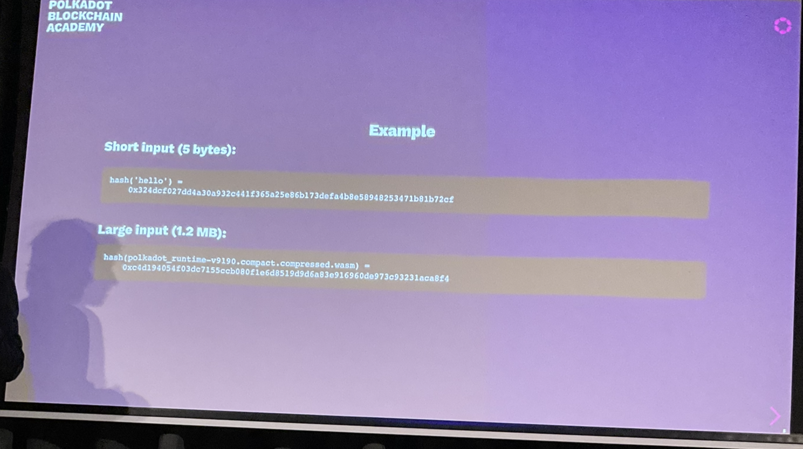
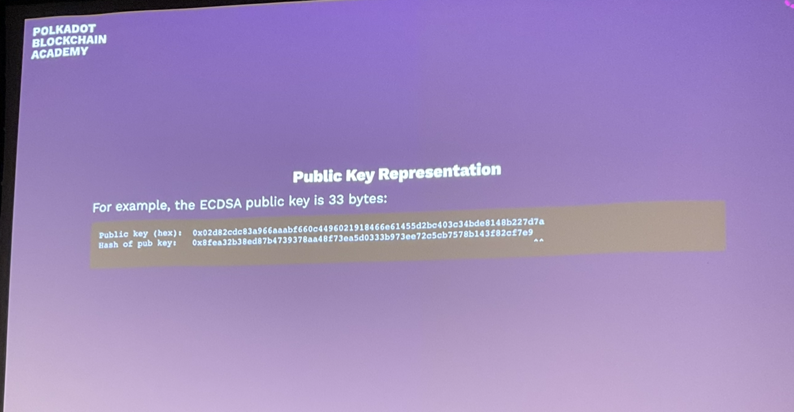
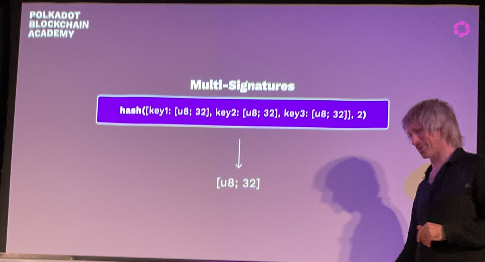
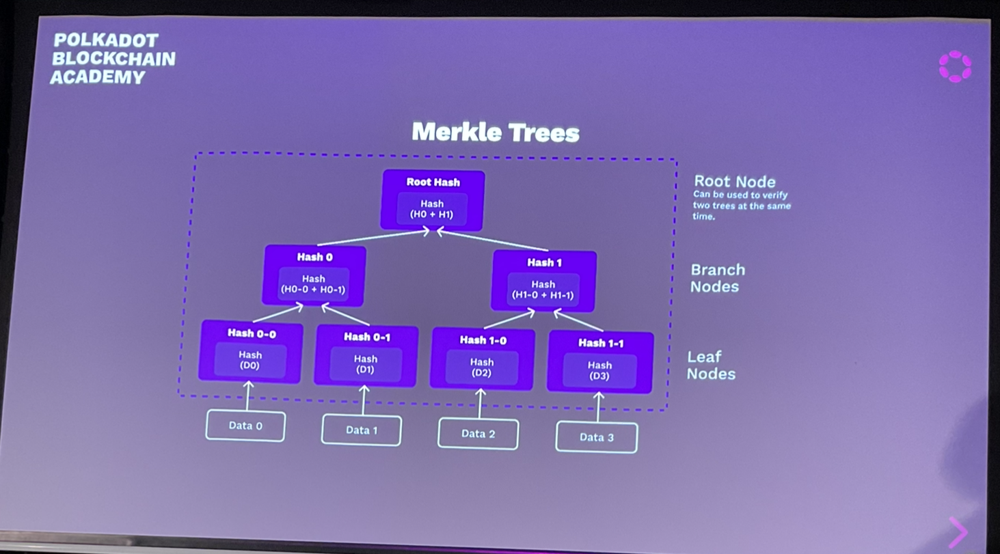
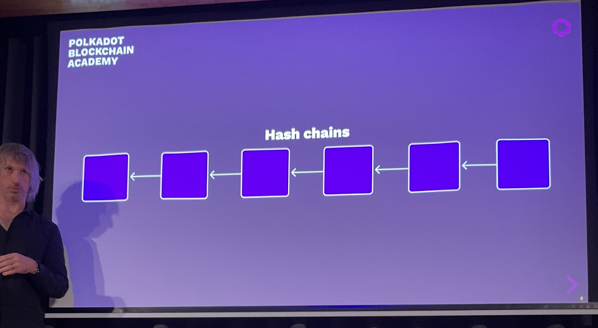
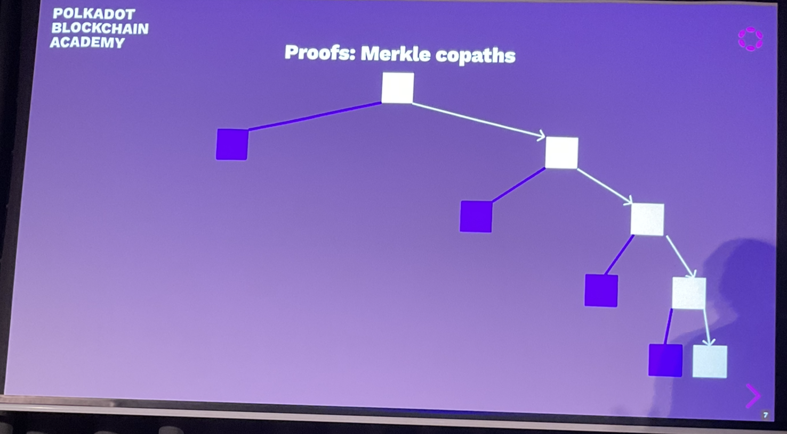
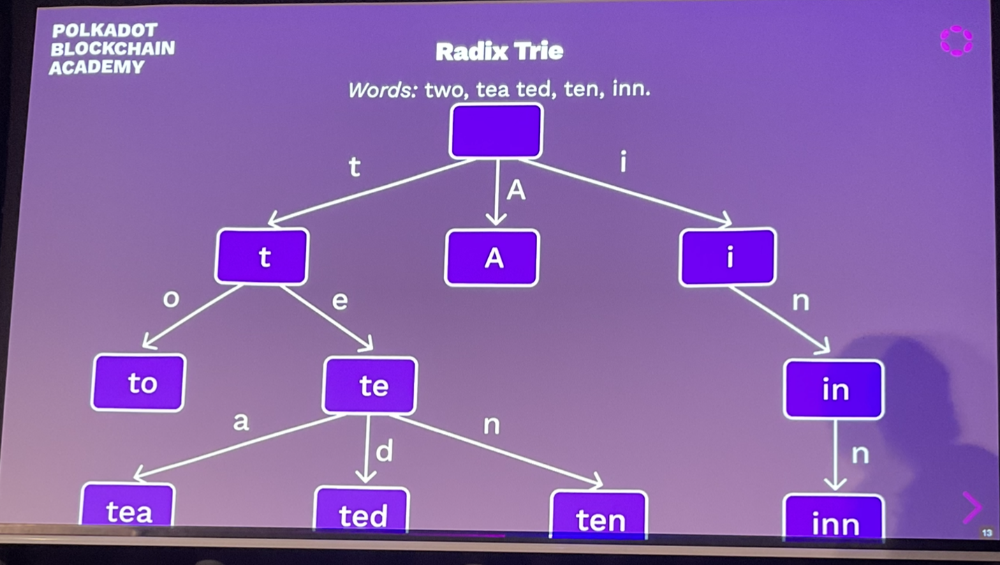
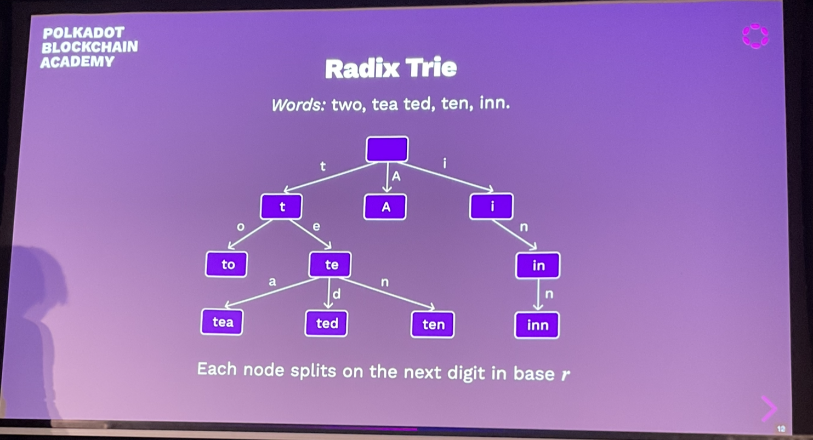
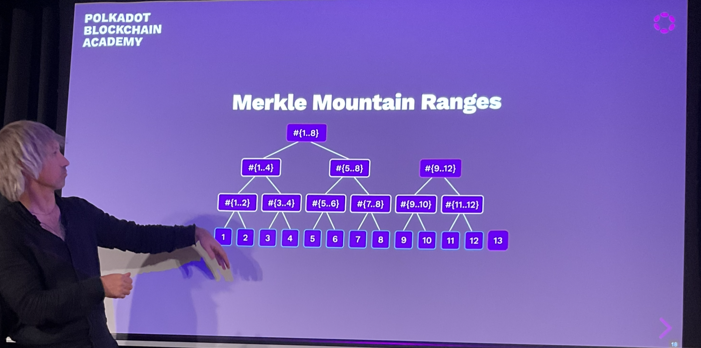
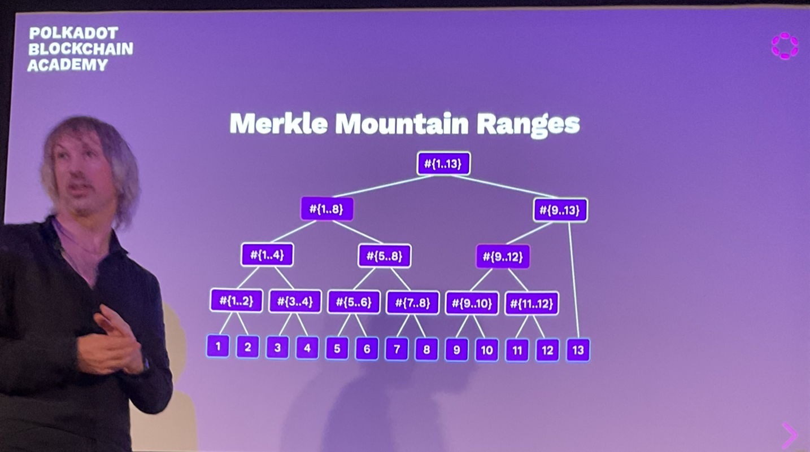

# Hash Functions

A succinct representation of some data.

Easy:
1. Accept unbounded size input
2. Map to a bounded output
3. Be fast to compute
Harder/interesting:
4. Be computable one way
5. Resist pre image attacks (attacker controls one input)
6. Resist collisions (attacker controls both inputs)

Proof of work style idea used to used to resist spam - didn't use a central authority.

When bitcoin took this on, the amount of work is variable.. A perfect proof of work in bitcoin would be to find a strict pre-image attack.

We find a pre-image attack that when hashed is all zeroes.

Bitcoin used the hash to find a variable length of the pre image. It doesn't need to be all zeroes. It just needs to be x out of y zeroes. Bitcoin is not one of these 6 values. Proper cryptographers will tut at this.

Hash functions were not strictly used properly, but it Bitcoins place it's basically fine. There are no sha2 exploits for the bitcoin hashing algorithm. It's not too bad.

It's important to understand this stuff so you don't accidentally misunderstand the guarantees.

The data exists only once, like a value within a set in maths. Every piece of data exists only once.

It doesn't matter where the data is stored. We can identify each piece of data with this 32 byte value.

Not mathematically, but for practical purposes a one to one mapping between every value we can come up with and a 32 byte value generate from the hash.

## Speed

Some hash functions are designed to be slow.
These have applications like password hashing which slow down brute force attackers.
For our purposes we generally want them to be fast.

(You can always make a hash functions lower by using multiple hashes)

## Non-Cryptographic Hash Functions

These provide weaker guarantees in exchange for performance.
They are OK t ouse when you know that the input is not malicious.
**If in doubt, use a cryptographic hash function.**

## Pre-Image Attack

- Difficult given `y` to find `x` such that `h(x) = y`

## Second Pre-Image Attacks

- Difficult given `h(x)` to find any `x'` such that `h(x) = h(x')`

Given a hash and a pre-image, it should be difficult to find another pre-image that would produce the same hash.
That is, given `H(x)`, it should be difficult to find any `x'` such that `H(x) == H(x')`

Bitcoin is a partial second pre-image attack.

## Collision Resistance

- Difficult to find an `x` and `y` such that `h(x) == h(y)`

It should be difficult for someone to find two messages that hash to the same value. That is, it should be difficult to find a `x` and `y` such that `H(x) == H(y)`.

## Birthday Paradox

With 23 people, there is a 50% chance that two share a birthday.

Hash function security only half of the bit space.

## Hash Function Selection

When users have control fo the input,
use cryptographic has functions (in Substrate, Blake2).
-Non-cryptographic (TwoX) is faster.
Safe only when the users cannot select the pre-image

IF we restrict the possible inputs they are allowed to choose, then we can use a pretty insecure hash algorithm and still have a substantial expectation that no attackers will realistically find collisions.

If we allowed 1000 values, we could test every possible input. We only need the big guns when the attacker has a big attack space, infinite possible inputs, within which to find a collision.

Can you write a program that enumerates every possible input, then brute force it yourself and check there are no collisions.

There could possibly be no perfect proof of work for bitcoin, as there may not be a pre-image to a certain output.

## Applications

### Database Keys

Hash functions can be used to generate deterministic and unique lookup keys for databases.

Usually we have an index column so that it is fast if you want to do a lookup on a row, whose value in that field/column you know e.g. library book id.

This is a bit different in blockchains. When indexing we will tend to need to put in our backend database a key that is of fixed length that has certain properties.

We may need to know that the keys, the actual data are fixed length and more or less random. Hence at attacker through directed use should be able to decide the keys are essentially random.

### Data Integrity Checks

Member of a peer-to-peer network may host and share file chunks rather than monolithic files. bit torrent is web3 (except for lookup which is centralised)

In **Bittorrent**, each file chunk is hash identified so peers can *request* and *verify* the chunk is a member of the larger *content addressed* file.

Given a hash for some pre-image, find a set of nodes that contain collectively all the data you use. In the magnet link there is a hash. The bittorrent software will then go off and try to find nodes that will eventually provide you will all of this data. When built together you end up with this final hash.

Imagine there is a collision, an attacker has compromised the hash function, the has of the data you are actually after (e.g. ubuntu dist). You get the ISO, it has a hash. If you change the ISO in anyway you would get a different hash.

Someone comes along who wants to infect he ubuntu computers with some dodgy software. They could change the ISO that looked exactly the same in everyway except it has some different code tucked away and then they could publish on bittorrent under the same name. However when the ISO is hashed, the hash would be different. The nodes serving the malevolent ubuntu would not be accepted. Unless the attacker was able to make the malevolent ubuntu hash to the same thing, they could make it work.

## Account Abstractions

Public keys can be used to authorize actions by signing instructions.
The properties of hash functions allow other kinds of representations.

Imagine a system needs fixed length names. Take the "gavin" and hash it for a 32 byte identifier. We do this for a bunch of names.

This is used in crypto to account for the fact that different blockchains use different lengths of keys. Hash them all to the same length.

e.g. the ECDSA public key is 33 bytes (and a bit)
whereas ED2559 is 32 bytes.

## Multi-Signatures

`hash([key1: [u8; 32], key2: [u8; 32], key3: [u8; 32]], 2) -> [u8; 32]` 

## Internal System IDs

Modules within a system may have their own information stored in other parts of the system.

Storage they authorise use of by the module's internal logic.

You have a system with some names, and you need to turn them into a means of reference which is fixed length. The path to a file may be very large. You know the paths won't conflict purposely. We need a way to reduce the length into a nice little box for our BE database that insists that keys are always 32 bytes. You could just truncate, that will only work if there is no duplication in the first 32 bytes of the paths. Hashing them down is a secure way of reducing these huge names.

## Commitment Schemes

It is often useful to commit to some information without storing or revealing it:
- A prediction market would want to reveal predictions only after the confirming/refuting event occurred.
- Users of a system may want to discuss proposals without storing the proposal on the system.

However, participants should not be able to modify their predictions or proposals.

We uses hashes as a tool to implement in the same way dice are in games. The games we play in crypto are normally economic. One way to use hashes is to force players to commit to something before they reveal what that something is - **commit-reveal**.

There is a game - "modern art". It is kind of card game with interesting mechanics. Modern art is sold at auction. There is a kind of auction called a closed bid auction. Often used for selling houses. People put their best bid in, but they don't tell anyone what the bid is. All bids get revealed at the same time, and the best one is taken.

In commit reveal, the players/bidders commit to a particular bid. After the deadline, everybody reveals what their bid is. You pick your bid by requiring people to submit a hash of your bid. Then you submit the pre-image of the hash.

By submitting the hash, though you haven't given the bid, you are now committed to it.

You have to incentivise players to reveal their bids. One way to do that is to require a deposit. If they don't reveal, they get their deposit back.

Building games is 70-80% of what we do in crypto. We want a game:
- people want to play, that people find useful, that is in service to people

We want to jointly commit ourselves to a course of action without bringing all of the information required to describe that piece of information into some singular central point that may in and of itself be expensive.

When we want to upgrade a decentralised network, you upgrade it to some new piece of software, maybe some code that it is often several mb big.

We don't want everyone to have to download a mb big blob of code in order to allow people to decide whether to upgrade to it.

The decision is different technical problem compared to the technical problem of sharing the blob of code itself.

We have people who run nodes, and voters. They are two separate groups of people (possibly with overlap). Instead we just need a secure reference to the code that can be voted on. We say that we agreed upon whatever the pre-image is to the hash we voted on.

## Commit-Reveal

1. Share a hash of data as a commitment `(c)`
2. Reveal the data itself `(d)`

It is normal to add some randomness to the message to expand the input set size.

`hash(message + randomness) => commitment`.

Hash the bid and share it with everyone else, then eventually reveal after deadline. As an attacker I can just go through all possible bids, the bid space is not that big. Instead we add 32 bytes of randomness (entropy) to the hash. When you reveal you can also reveal the randomness too.

We don't try to protect people from themselves when designing games in game theory, we protect people from other people i.e. we don't force people to add randomness to their commitment hash function, but they should for their own interest.

Consensus games can go wrong if their is ambiguity i.e. what is the length of the message, if the message is `10` and the randomness is `0s334rljwltejk` - is the message `10` or `100`? In which case the solution is to define the length of the message.

## Data Structures

Data structures and time/space complexity is immensely important in blockchain systems.

If you can force machines to do 1 or 2 orders of magnitude more work than they are meant to do, you can damage the system.

You could force a machine to do more work than it is supposed to **the shanghai attack**. In real life it is not too difficult to change the rules (vs blockchain is very hard).

If the rules don't work you have a big problem.

### Pointer-Based Linked Lists

Pointer-based linked lists are a foundation of programming.

But pointers are independent of the data they reference, so the data can be modified while maintaining the list.

That is, pointer-based linked lists are not tamper evident.

Gives a strict guarantee of constant complexity additions and withdrawals.

### Hash-Based Linked LIsts

A blockchain is a hash based linked list.

Hash-based lists make the reference related to the data they are referencing. The properties of hash functions make them a good choice for this application.

Any change at any point in the list would create downstream changes to all hashes.

Bitcoin was hash-based linked list + proof of work + sha256.

You cannot insert and remove elements in a hash based linked list.

## Merkle Trees

Allows us to represent sets or maps with the expectation that you will be able to get an intrinsic description for that set.

A cryptographic merkle tree allows to determine the root hash only from the next level of hashes.

Someone down the pub tells us `Hash 1`. Then we can just hash `0`, `0-1` to get `0`, and then hash `1` and `0` to get the root hash in order to verify it is correct. We didn't need to trust the guy down the pub, but he was still useful to us.

A lot of the games revolve around deriving utility from information from sources we cannot trust.

## Comparison to pointer based data structures

- A hash is a commitment to what is in the linked part
  - a pointer tells you where it is
- You can't have cycles of hashes

### Hash Chains

### Merkle tress

A binary merkle tree:

## Types of data structures we'll look at

- **Trees** - Rooted, Undirected, Acyclic Graphs (direction determined by the root)
- **Merkle Trees** - trees which use hashes as links (crypto trees).
- **Tries** class of tree:
  - Given a particular piece of data, it will always be on a particular path.
    - You know by the data exactly where it is on the tree.
- **Radix Tries** - a class of trie:
  - The location of a value is determined by the path constructed one digit at a time.
    - We pull the key apart one bit at a time, and hence determine where we go on the tree based upon the value of that slice. Then we recurse down and take off another little slice of that tree. We keep doing that until we run out of key. Then when we run out of key, we place the node there on the trie.
- **Patricia Tries** - *radix tries* which are optimized to ensure lonely node-paths are consolidated into a single node.
  - WILL BE USED THE MOST
  - specific instance of radix tries where there is only option at every branch.

## Proofs

- the root or head hash is a commitment to the entire data structure
- Generate a proof by expanding some but not all hashes

We can in principle take the values that constitute the tree. Serialise them, order them. Hash it. Now we have a identity, a reference. Now that hash only refers to this content.

We could prove given that someone knows this hash. As someone who doesn't know what the hash means. I don't know/need to know given the hash what those values are. The hash has an identity relationship with those values. We don't know the values themselves from the hash. If somebody shared with us those 16 million values, and we serialized them, sorted them, hashed them, we would end up with the same hash. If we believe that the 16 million values whose hash was this value, had some particular meaning (i.e. the 16 million words of wikipedia at some particular date), then we can provided with the information at some later stage and we can verify it. If you have some way of identifying that the pre-image of the hash is meaningful, you can verify it later.

Maybe we don't want to have to download all 16 million words into to read one article. We just want to know what one article was in wikipedia at that time. We happen to know what the hash is because that is easy. What we want is a proof (engineering proof) that this is in indeed the wikipedia article of 1978. We need to take the article asa bunch of words, and the index into the encyclopedia where the article is, and we want a proof as succinct as possible, showing that this is indeed the slice of wikipedia we expected.

We can do this succinctly with merkle trees.

**We are proving that particular bits of a dataset are correct without being given the dataset as a whole.**

- Proof of a leaf has size `O(logn)`
- and so do proofs updates of a leaf

## Kev-value database

The data structure stores a mpa `key -> value`
We should be able to
1. Add new key value pairs
2. Change the value associated with an existing key
3. For any key, if it is in the database we can prove it.
4. If no value is associated to a key, we need to be able to prove that as well.

Two identical sets of key value pairs have identical identities.

## Radix Trie

*Words:* to, tea, ted, ten, inn, A

A radix trie is not necessarily a merkle tree.

## Patricia Trie

The **inn** word is simplified, you just have one node instead. These nodes can be called extension nodes.

Ethereum uses extension nodes.

Substrate lets all branches use extension nodes.

## Hash trie

Does not refer to the fact we use hashes to refer to particular nodes. Refers to the fact we hash keys before we insert them.

- We may pre-hash the data before inserting it
- This improves the balance... expect under attack!
- Could be a Merkle trie or regular (pointer based).

If you are not careful you can end up with a very unbalanced trie.
This is problematic if e.g. you are having to access a slow database for each node. This could be a 6-10x slower. This is an attack scenario.

If I am amble to control what values/keys I put in the trie, I can effectively also control the structure, and hence the access characteristics and hence how big proofs are. Proof size is the one thing that merkle tries have going for them.

It is crucial that an attacker cannot control the access characteristics and hence what keys are used in the trie.

We require that the keys must be passed through a hash function, which prevents the attacker from controlling what keys get inserted into the system.

They could run through pre-images until they find one whose hash exists at the right point in the trie, but that takes a lot of time. So we are now making it cost them. We could add multiple hashes but this would slow honest actors down significantly too.

Say we want to enumerate all keys between one value and another value. The keys are no longer in order. So we cannot do this. We could say we will retain a prefix, and hash before and after the prefix, before the prefix they will be ordered. If we know the hash of the prefix, we can get there in the trie.

We can get a pretty good degree of balance if no one is trying to attack.

*The attackers job becomes harder the fuller the tree is*

It is one off attack, but the effect is essentially ongoing.

This constitutes a partial pre-image attack.

## Computational and storage trade-offs

- What radix `r` is best?
- Proof size of a leaf is `rlogᵣn`
  - `r = 2` gives the smallest proof for one leaf... but:
    - higher branching at high levels of the tree can give smaller batch proofs.
    - For storage, it is best to read consecutive data so high `r` is better.

If proofs become to big, users are effectively forced to place their trust in central authorities because it becomes too much effort to do the proof. The ethereum blockchain is kind of decentralised. But it's not decentralised in regards to how you actually access the information on the blockchain and introduce information to the blockchain, where you use an RPC node. This is usually hosted the consensus organisation which happens to solely owned by one of the founders of Ethereum. You are using the service provider that is consensus.

The way to fix this (this is not an ethereum specific problem) is to use proofs.
So that the computer that is providing you with some access to Ethereum, which for all you know is the bloke down the pub, you can verify that what they are telling you is correct, assuming you know what the correct root is.

If you have a good degree of confidence about this merkle root.

If you have your own node on Ethereum, you can prove and check things yourself.

Dot doesn't have these problems. It's a client that doesn't try to download everything. It just downloads the bits you need right there and then and verifies them using Patricia Tries.

## Merkle Mountain Ranges

- Append only data structure
- Lookup elements by number

A series of increasingly smaller merkle trees.
You end up with a relatively low resource footprint in order to get the root having add some number of elements.
Like a vec you keep appending too, and eventually you need to get an identity for what you have created so far.

So far we have been talking about optimisation. It could also be that I am not allowed to know the rest of the information - they want to keep it secret.

In this image there are 3 tries, one only has one element.

You cannot add trees that are the same size.

Tries of the same size must be merged together.

As you add items, eventually the trie merges into one trie.

This is difficult to implement.

# Succinct proving with cryptography

- ZK friendly hashes
  - It is very slow to prove say blake2 in ZK proof/rollup.
  - This is an ongoing research area
- Non-hashed based data structures
  - RSA accumulators
  - Polynomial commitment based
    - Verkle trees
      - We do a thousand way tree (a merkle trie would do about 16 - otherwise I have to give you lots of info to do thee hash proofs). 

Vector commitment schemes - I can prove one of these.

These ZK proofs are performance expensive.

## Other notes

Bitcoin was a military thing. US used to disallow foreign downloads.

One of the applications of a cryptographically secure hash function so you can take any piece of information and run it through the hash function and get another bunch of bytes that have to relevance to the inverse. Changing one bit of the input should have a 50% chance of changing all of the bits of the output. The output is random. It is determinist but random.

This is what gives it those guarantees. It becomes pretty clear that what we can do is keep feeding the ahs function back in on itself. We can take a seed which can be anything, then hash it and get a random and deterministic output. It's not entropy because it is entirely deterministic. The entropy only comes from you and your choice of pre-image.

Before you compute the answer, you will not be able to guess better for each bit better than 50% of the time.

Cryptoanalysis is the act of trying to find static relationships between the input and output of hash functions. Hash functions should not allow those connections. The input is entirely unpredictable from the output.

A cowboy use of hash functions is as a pseudo random number generator.

Hash functions are not mathematically proven things, they are practical/engineering proof. It's Hard with a capital H belief.

If you manage to find a pre-image that is a valid bitcoin block.

## Questions

