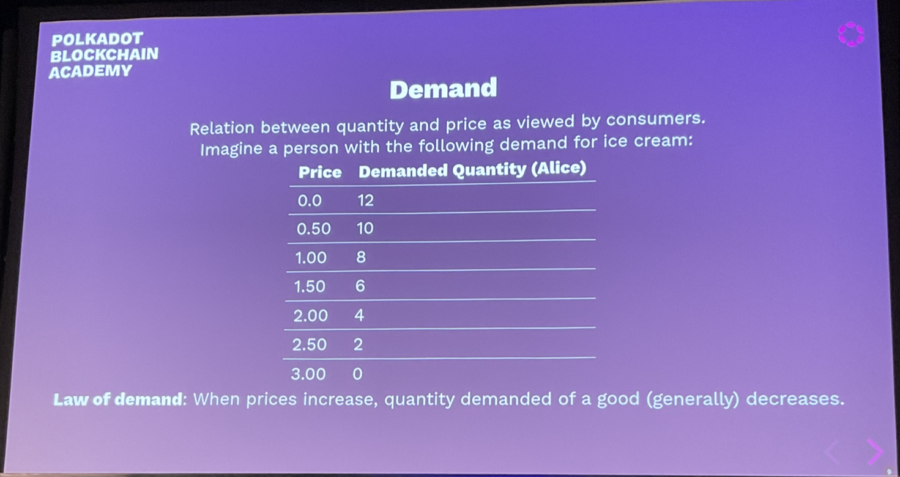
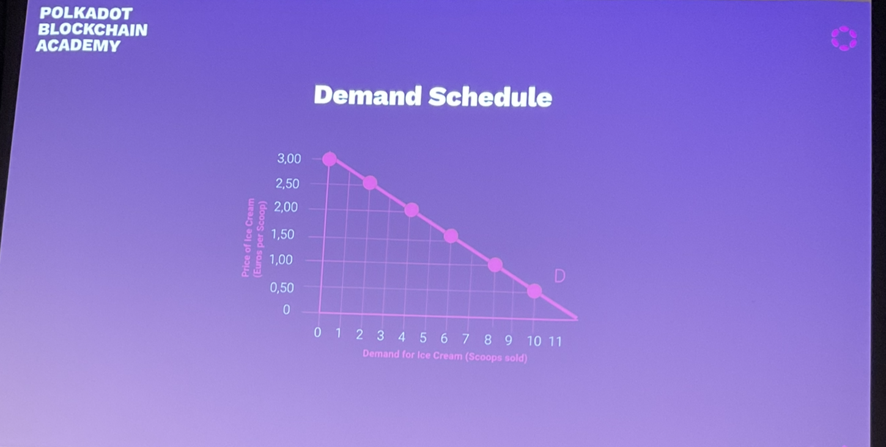
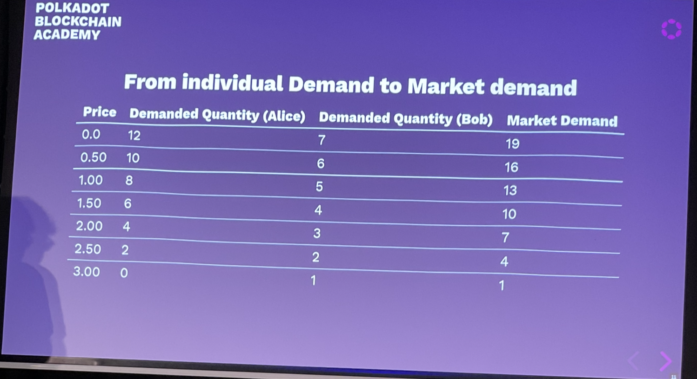
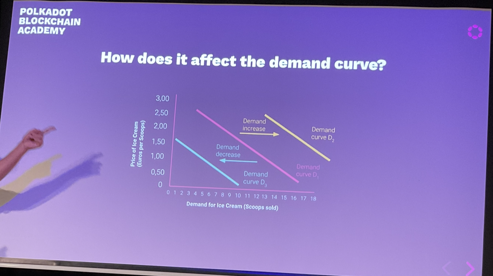

# Crypto Economics

## Teacher

- Jonas Gehrlein
- Research scientist at Web3 Foundation
- Github: @jonasW3F
- Twitter: &GehrleinJonas
- Matrix: @jonas:web3.foundation
- Linkedin: jonas-gehrlein

Worked on:
Recommending validators to nominators. It is very hard for people to go through the whole list of alternatives and decide based on the tradeoffs so he created some active learning algorithms to handle this).

## Intro

Economics is the study of how humans make choices under the conditions of scarcity.

Perhaps time is the ultimate resource. The resources in the universe are quite large and even infinite, so you need to decide how to use your time efficiently.

- Important for daily life
- Important to understand and design blockchain protocols.

Learning objectives: bUilding a common understanding of core economic concepts:
- Use in upcoming economic lessons.
- Apply to the blockchain space (you are asked to apply the learned concepts in some discussions later).

In crypto we have to trust cryptographic principles, and we have to trust the economic design of the system.

## Outline

1. Lecture - 60 mins
   1. Demand & Supply
   2. Market Forms
   3. Economics of Specialization
   4. Behavioural Biases
2. Discussion & Workshop - 120 mins
   1. Discussions to foster and apply concepts we learned.
   2. Hands-on application

## Demand & Supply

- A strong summer at the German Nordsee reduces hotel prices in Sicili, a famous artist dies and her art increases in price.
- Underlying mechanism of the function of markets
- Determines the quantity of produced goods and their market prices.

### Why do we discuss this?

- It is fundamental to market equilibrium.

### Demand



At price 0, the demand is not infinite as you only need so much.

**Law of demand:** as price increases, quantity of a demanded good generally decreases.
  - This is not always true
    - Can be different for luxury goods.

## Supply





## Influences of demand?

- The price
- Income
- Price of substitution goods
- Preferences
- Expectations
- Number of consumers



- Supply is the other side of the market

**Law of supply:** Ceteris Paribus, the supplied quantity increases the demand decreases.

## Demand meets Supply

If this happens we get equilibrium.

## Influences on Supply

- Technology
  - Technological advances change production
- Expectations
  - Produced quantity changes expectations about the price
- Sellers
  - The number of sellers

### Summary

- price up, demand down
- Multiple factors influencing supply & demand.

## Market Forms (why monopolies are bad)

- Three market forms
  - Perfect competition: many firms, many consumers
  - Oligopoly: mor than one firm, many consumers
  - Monopoly: One firm, many consumers
- Higher competition - the less market power it has
- Market power is ability to affect the price (by choosing production level)

- Monopoly
  - Postal services in many European countries
  - Railway services in many European countries
- Oligopoly:
  - Cloud providers (AWS, Google)
  - Browsers
  - Mobile phone services
- Perfect competition
  - Consumer products i.e. iced tea.

The web2 landscape is an oligopoly.

Web3 is trying to break this up.

## Perfect Competition

- single firms production quantity: `q`
- price: `p`

```
maxq pq - c(q)
```

Here, `c(q)` is the cost function of the firm. We usually assume that it is increasing and convex:
```
c'(q) > 0....
```

- The optimal quantity `q` satisfies `p = c'(q)`

## Monopoly

- High barrier of entry to the market (investment/legal restrictions)
- The monopolist is the price maker.
- Monopolist can choose `q`
- Market demand: `P(q)` which is a decreasing function
- Then the problem of the monopolist is:

```
maxq P(q)q - c(q)
```

Marginal cost is the cost of one more item.
Marginal revenue is the earning for one more item.

#### Questions

Most of the world's diamond supply comes from sout african states. Assume that the marginal costs of mining a diamond is 1000 usd and the demand functions is characterized by `P(q) =  13000 - q`

**Dead weight loss:** the loss from monopoly.

Monopolies are bad because of unrealised gains form trade.

### Oligopolies

Somewhere between monopoly and perfect competition.

## Economics of Specialization

"It is the maxim of every prudent master of a family, never to attempt to make at home what it will cost him more to make than to buy." - Adam Smith, 1776

Concepts:
- Comparative advantage
- Opportunity cost
- Gains from trade

### Economic question

- Many countries trade even though one has an advantage in producing many of the traded goods.

In dot we have specialized blockchains (para chains) to share security.

## A simple of model of specialization and trade

- Alice and Bob
- Both are farmers than can produce meat and tomatoes
- Alice can produce both more meat and more tomatoes per hour

- meat: alice: 2hrs/kg, bob: 6hrs/kg
- tomatoes: alice: 1hrs/kg bob: 1.hr/kg

## Autarky

- Alice - .5kg meat ph, 1kg tom ph
- Bob 1/6kg m ph, 2/3kg tom ph

## Specialization

they both do better after all when trading.

Alice has the absolute advantage in producing both, she has a comparative advantage in only one of them due to time limits.

Bob has lower opportunity cost for producing tomatoes than Alice.

Even if someone in the team is a beast, the others are still useful.

## Behavioural Biases

- For a long time economic theory was built on the assumption that their actors were rational.
  - No other-regarding preferences.
  - Processes all available information efficiently
  - Not influenced by emotions.
- This may work will in some circumstances on the aggregate level.

## Behavioural Economics

- Concerned with the bounds of rationality
- Influenced by psychological aspects such as emotions, cognition and cultural stuff.

Behaviour is not random.
- Confirmation bias.
- Sunk Cost Fallacy
- Herding Effect
- Gambler's Fallacy
  - people expect tails after a bunch of heads.
- Default effect
  - people ten to stick with pre-selected choice.
- Overconfidence
  - people over estimate their biases

Simply put, the stock market is a creation of man and therefore reflects idiosyncrasy -- Ralph Nelson Elliot.

## Monopoly

- Google
- Uber
- AirBnb

## The Economics of Interoperability

Polkadot multichain has a specialisation advantage.

## Activities Today & Tomorrow

- You can earn points.
- In session 2.1, 2.2 and 2.3, you can increase your budget (starting at 0) during several economic games.
- Total budget of $1800
- The budget is split between all the games that we play and total points earned by all of you are dynamically adjusted to correspond to the budget
- In 2.3, there is a big final: You can use your earnings to bid for amazing NFTs by a professional artist in an experimental auction setting.
- Disclaimer: if a bug occurs and the reward points are messed up or something else goes wrong, we may intervene

## Other Notes

## Questions

Can we go over the  perfect competition equations again.