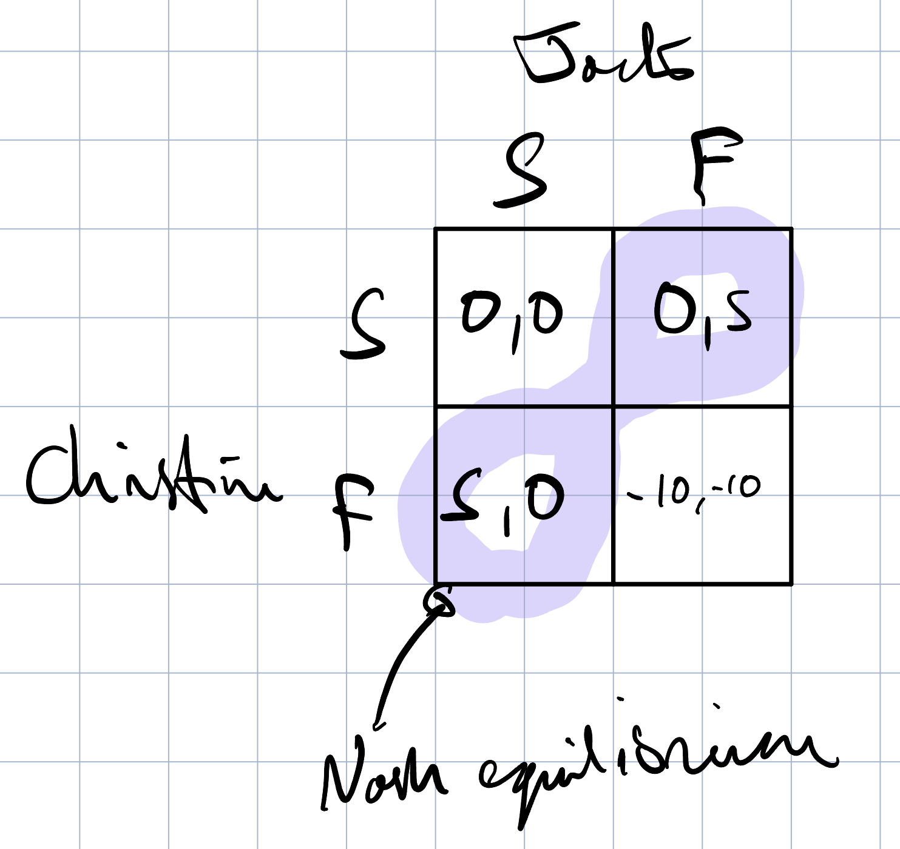

# Game 1: Ultimatum game

- Randomly matched with another student in the classroom.
- anonymous
- Player 1 gets an endowment of 100 points
- Player 1 can offer Player 2 between 0-100 points
- Player 2 sees the offer and can decide to accept or reject the offer.
- If the offer is accepted the endowment is split.
- If the offer is rejected, you both get 0.

## Game Theory Basics

Game theory is the study of mathematical models of conflict and cooperation between intelligent and rational decision makers. Rational means that each individual’s decision-making behavior is consistent with the maximization of subjective expected utility. Intelligent means that each individual understands everything about the structure of the situation, including the fact that others are intelligent rational decision makers.
- Roger Myerson, 1986

## Game Theory in Web3

- **Tokenomics:** Design of how people interact in the system.
- **Consensus:** Do the nodes in the network have the right incentives to achieve consensus.

## History of GAme Theory.

- Started early 19th century.
- Systematic study started in 20th century
  - Atomic arms race - stalemate between the two countries.
- Modern game theory is in economics, biology, sociology, political science, psychology among others.

## Game theory is abstract

- Model the essence of the strategic interaction.
- Pros: *abstraction* - allows analysis.
- Con: lack of realism.
- Tradeoff between tractability and realism.

## Define a Game

A game is a strategic interaction between several players, where common knowledge among all the players of the game includes:

1. all the possible actions of the players
2. all the possible outcomes
3. how each combination of actions affects the outcome

## Types of games

- Complete information
  - Everything is known
    - know if they are fair or not fair
    - know both players want to win
    - know cost function of other firms
- Incomplete information
  - preferences are not common knowledge
  - cluedo/among us
  - most art auctions. People tend to have highly subjective preferences that they only know themselves.

## 3 firms want to hire an engineer

Engineer pays off $300k per year.

If they all reveal at once it is static.

## Nash Equilibrium

It is 20 in the game we played, the stable point in the system.

## Schelling points

The schelling point - the most reasonable thing to do.

Where do we meet in NY? we cannot communicate. You go to the Grand Central Terminal at noon.

If there are multiple equilibrium, social norms help to choose one.

## Public-Good Game

- Non-rivalrous - my consumption does not affect yours
- Non-excludable - no one can be excluded from consumption

e.g. fireworks, polkadot's public good parachains.

Each player has 10 dollars.

Each player `i` can choose how much to contribute to the public good.

