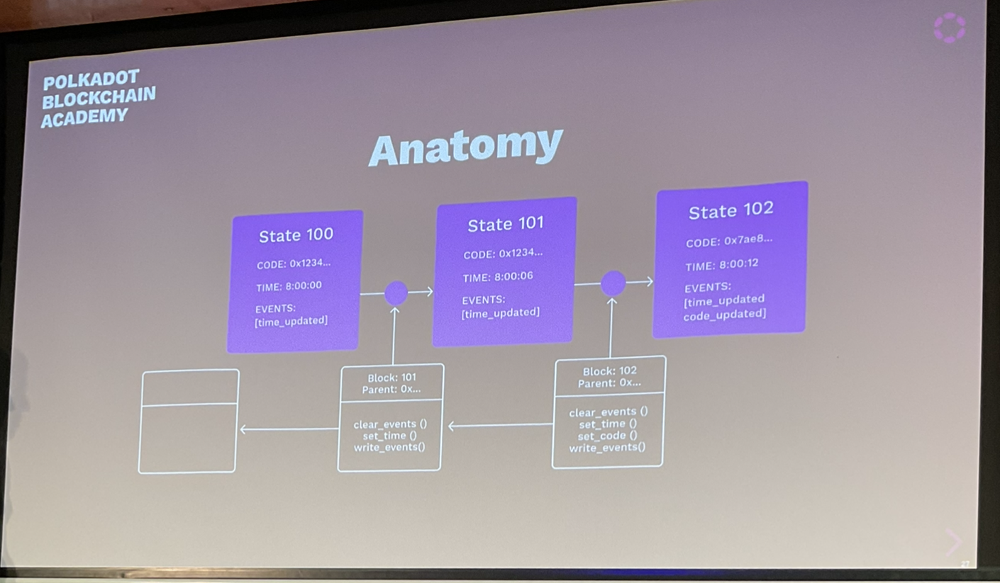
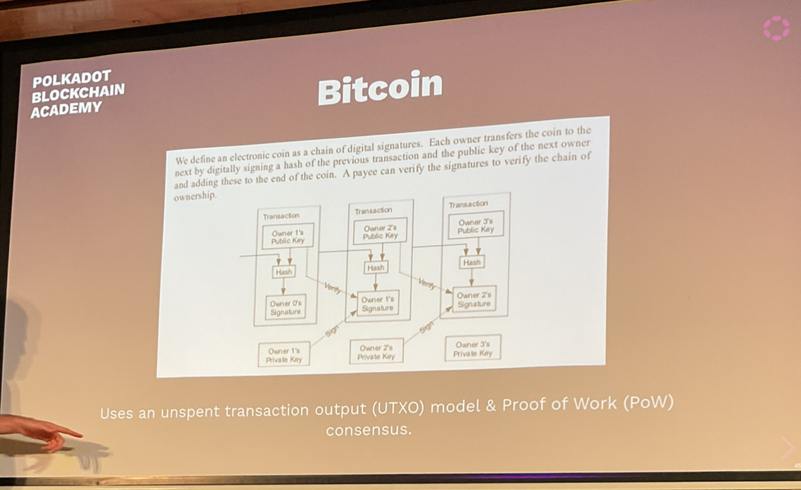

# Module 3, Lesson 1: Overview of Blockchains

What is the core problem we want to solve?

## Comparison with Cryptography

Cryptography provides strong guarantees about messages without a trusted party.

## Web 1

Users generally transmit information peer-to-peer.

Cryptography upholds its guarantees when used like this.

## Web 2

"Send us your information"

Platforms started offering digital services.

However you have to place faith in the service provider.

## Web 3

- Permissionless access
- Privacy
  - Credible expectations about what information they give up about themselves.
- Authenticity
- Finality
- Behaves as expected even if the operators do not
- Unstoppability

## Trust

What is trust in this context? Blind faith.

### Trust Examples

Two users on Twitter:
- Trust that we are seeing information from the same database*
- Trust that ifa tweet is from X, then X wrote that tweet*
- Trust that others see our messages as from us*
- Trust that the messages we see are the messages the users wrote*
- Trust that we're interacting with the application as equals

## Digital Services

- Twitter, Instagram, Facebook, etc.
- Journalism and sources
- Banks
- Lawyers, notaries, regulators

## Disintermediation

Removing trust allows us to unpackage applications.

## Application Disentanglement

- User Interface
  - Devices, languages, UX preferences, tinkerers
- Curation
  - Feed algorithms, content moderation, social network partitioning
- State
  - Data, access, rules

You can imagine an open Instagram/Facebook that would allows you to design your own UI and algorithms to interact with the source data.

People try to design their blockchain for an application. We could build the leanest meanest blockchain possible, think about what is the information I want to store and how will people interact with it and then a bunch of other things can be built on top of it.

## Desired Approach

Allow users to interact with a common system without trusting any intermediaries.

## Blockchain Finally

Blockchains were not the first attempt at distributed state machines.
- Redundant systems in mission-critical engineering
- Data centers
- High availability applications

## Constraints

Most of these examples assume benevolent participants and an admin.
Blockchains are adversarial with no admins.

## Blockchains

- Consensus
  - How does the state advance?
  - Which changes are final?

### State Transition Function (STF)

- Data Stored
  - Account Info
  - Balances
  - Authority Set
  - Timestamp
- API & Behavior
  - Function calls
  - Implementation
  - Responses

## Example: A Simple Storage Item Write

```rust
// The ideal number of staking participants
#[pallet::storage]
#[pallet::getter(fn validator_count)]

// Sets the ideal number of validators.
...
```



### Blocks

- Header and a body
- Consensus-related info: number, parent hash, some digests.
- Body contains an ordered set of *extrinsics*: Packets from the outside world.


### Headers

Consensus-related info. Varies per blockchain, but in Substrate:

- Parent hash
- Number
- State root
- Extrinsics root
- Digest

The parent hash links blocks together (cryptographically linked list). The other info is handy for other infrastructure and applications.

## Other Headers

Bitcoin:
- Version
- Previous Hash
- Tx Merkle Root
- Time
- N_Bits
- Nonce

Ethereum:
- Block Number
- Base Fee
- Difficulty
- Mix Hash
- Parent Hash
- State Root
- Nonce

Header is always the same size.

## Extrinsics

Packets from the outside world with *zero* or more signatures attached.
- Function calls to the STF (state transition function)
- Some functions require signatures (e.g., transfer some tokens)
- Other don't, but usually have some validation means


## Consensus

Whole next lecture is dedicated to consensus, going to stay strictly conceptual.

### Liveness

- Property that ensures state transitions will happen. The system should be *available*.
- Someone needs to propose a state transition (within a block) and a resultant state.
- Motivation for actors to do so.

e.g.
deciding who should submit the state transition and motivating it:
- Static leader
  - this is done on planes - it is a basically closed system. They trust the different computers. If the leader starts acting funny, the other computers can kick it out and take over.
- Round robin
  - Take turns, you have 10 nodes, go round from 1 to 10.
- Proof of Work
- Random assignment protocols
  - Applicable to polkadot.
    - There are a number of attack vectors - we need selection to be random so we cannot DDOS each leader

### Safety

Once a state transition occurs, under what conditions can users have a credible expectation that it won't be reverted.
- Probabilistic
- Deterministic

e.g.
- Longest chain
- Most difficult
- Practical Byzantine Fault Tolerance (PBFT) (per state transition)
  - Propose a state transition and then we all run the PBFT algorithm and decide if that is okay
- PBFT (on batches)
  - Polka does this, runs PBFT on a batch of blocks.

### Deterministic Finality

What does it mean when a final block is reverted?

Normally we assume that more than 2/3 nodes in the system are dishonest.

### View

No node has an omniscient view of the network. Therefore, one node may always have more information than another node.

But they should never believe an incongruity.

### Security

- Lazy: Omnipotence (AWS, Twitter, Bank)
- Some "proof" of authority, as defined within the system itself
  - Wasting energy (trivial)
  - Putting stake at risk
  - Being elected by participants via their willingness to put their own stake at risk

### Punishment

If some of the authorities in a system fail to uphold their guarantees, the system should have a way to hold them accountable.

In blockchains, this is usually accomplished via either lack of reward or explicitly seizure/destruction.

We factor in game theory here.

### Unscrupulous Actors

- Technical design
  - key choices
  - public API
  - Hash choices
  - Stored data
  - Transactional/autonomous logic
- Economic design

### STF Upgrades

All systems need to upgrade to stay relevant.

Bug fixes, new functionality, new information.

This can be tricky in blockchains...

## Bitcoin



## Ethereum

- Generalisation of Bitcoin: Provides a quasi-Turing-complete VM
  - Quasi-Turing-complete because eth has a mechanism (running out of gas) that will stop something executing if it takes too long.
- Uses an account-based system
- Accounts can store balances, but can also store executable code (smart contracts)
- Each contract can have its own internal state and API

## Proof of Stake

Ethereum uses Proof of Work, but plans to transition to PoS.

Many new protocols are PoS.

Covered in more depth in the next lecture.

## Hard Forks

Historically, upgrading blockchains meant getting everyone to update their node software.

"This had made many people very angry and has been widely regarded as a bad move."

## Polkadot

Who actually defines teh STF?


**In Substrate chains, it's part of the state itself!**

```
:CODE => <some-wasm-executable>
```

## Many State Machines

If you have lots of totally different blockchains, the CPU power of the world is diluted.

- If one state machine with such guarantees is useful, people will probably want more.
- But security can be diluted.
- Polkadot is designed to *host* a large number of sovereign state machines. We call them parachains.

## Specialisation

Different state machines will specialise in different things (assets, privacy)

But applications will want to pull from many of these capabilities.

So these state machines should have messaging protocol to interact with each other.

## Substrate

Practically, these parachains will have a lot in common:
- Similar needs for accounting units, databases, RPCs etc.
- All need to "speak the same language" i.e. compile to Wasm

Substrate was created to make this part easy.


## Questions

- What is the state root?

