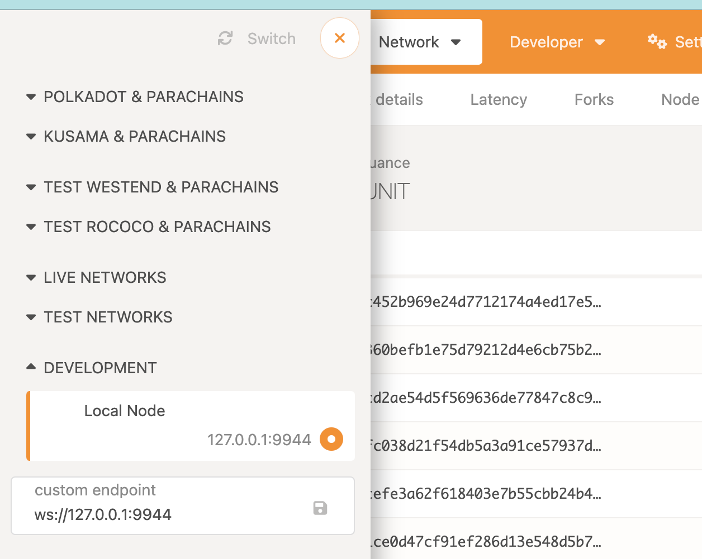
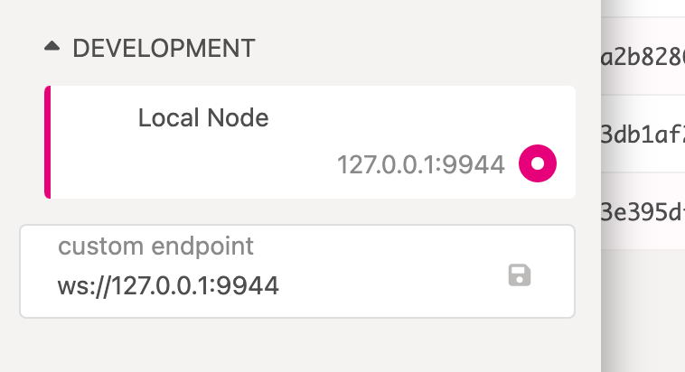
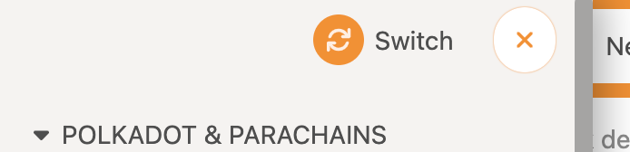

# Running a node

Always build in release mode.

Run in dev:
```bash
./target/release/node-template --dev
💤 Idle (0 peers), best: #24 (0x8cca…8b71), finalized #22 (0x1fa4…5d7e)
# notice best is above finalized, this is a dot optimisation
# because block authoring is o(n) and finalising is o(n^2)
extrinsics (1): [0xeb45…4796]
# there is one extrinsic for each block - the timestamp set
```

- https://polkadot.js.org/apps/#/





Click switch



tom
password
heart apple defense strike oblige fox distance claw neglect reject glow naive

```bash
# this won't author without peers
./target/release/node-template --chain local --validator --alice 
# this will force author
./target/release/node-template --chain local --validator --alice --force-authoring
# add another author --base-path updates where files are saved so that you can run two nodes at once
./target/release/node-template --chain local --validator --bob --base-path /tmp/bob
# build a shared network spec to work with everyone
./target/release/node-template build-spec --chain local --raw > toms-custom-chain.json
./target/release/node-template build-spec --chain toms-custom-chain...
```

Building the chain-spec is non-deterministic, hence you need to share it with people so they can use your genesis block if you want to join the same blockchain network.
