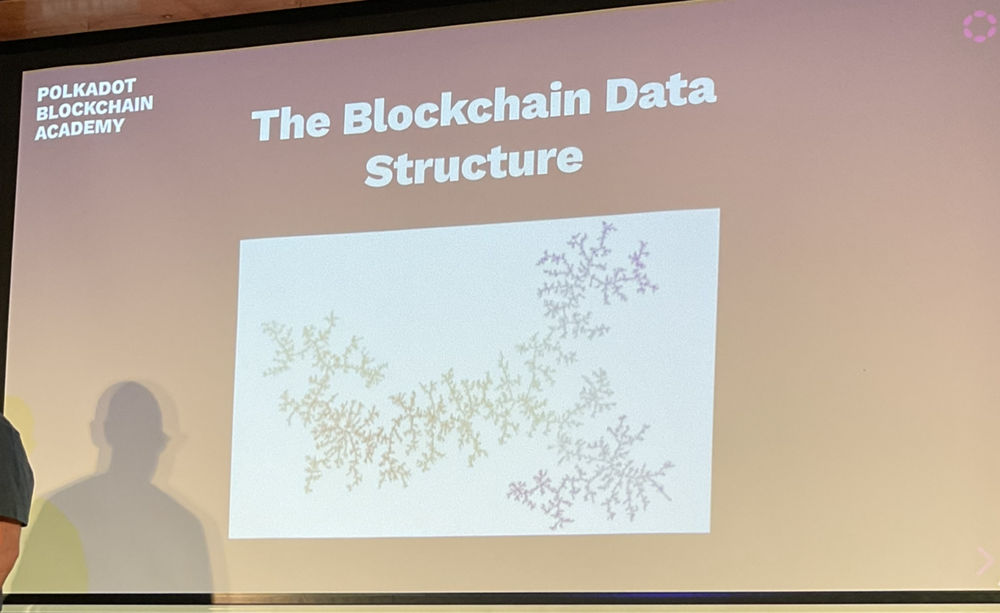
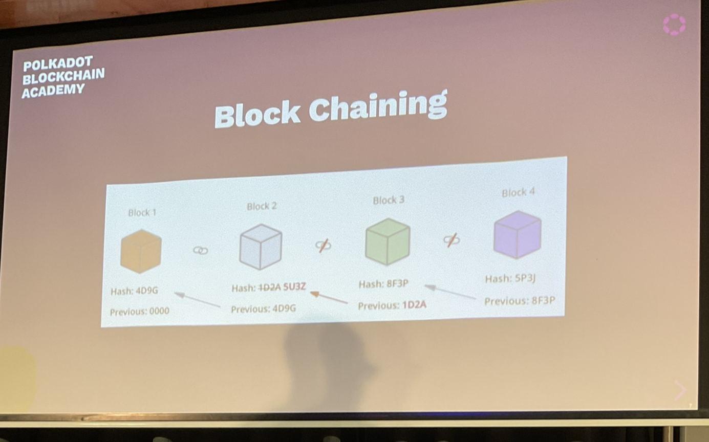

# What is a Blockchain

Teacher: Emre

It is just a database. But it is different to databases we are used to.

## The Blockchain Data Structure

The longest list in this tree.

## What is in a Block

- Block hash
- Hash of previous block
- Data

You need to be careful how much data you are putting on chain. You can use IPFS for example.

Things stored on chain are normally stored using Merkle tries.

There are certain abstractions on top of that database. If you have large data like JPEGs for your DAP, you will want to store those in IPFS and use off-chain workers to fetch the data using an on-chain hash.

## Assignment Grade Chain

1. Each participant will get their own block, we will take turns and insert our own blocks
2. Input your data: Name and quiz grade
3. Input the hash of the previous block
4. Calculate your hash and add it to your block
   1. Add up the characters in your name with your grade adn the previous hash values
   2. The sum will be the value of your hash

Block
- Hash
- prevHash
- Name
- Grade

NextBlock
- hash: prevHash + name.len() + grade

### Probabilistic Finality

In nakamoto-consensus, the probability of the finality of a block increases as the block gets deeper.
