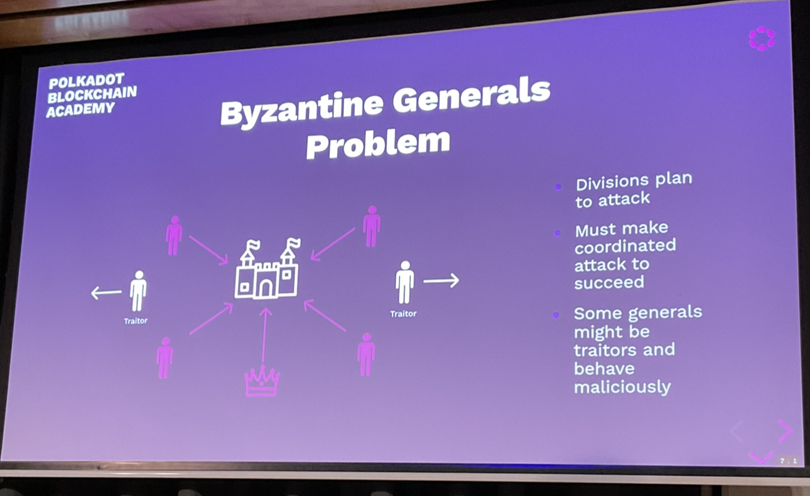

# Consensus

Instructor: Joshy Ordonoff

A decision making process that strives to achieve acceptance of a decision by all participants.

If you trust everyone it is easy to come to consensus. This is harder on the open internet.

Social hierarchy can work - the leader proposes the decision and the group collectively follows.

## Adversarial Conditions

- Participants want to agree on something
- They don't trust each tother
- Some could be faulty or make mistakes
- Some could be straight up malicious

## Desired properties

All honest participants...
- Termination - they reach decision eventually
- Agreement - reach the same decision
- Integrity - Reach at most one decision, which was proposed by at least one participant.
Also:
- Validity - if all participants unanimously propose the same decision, all honest participants reach that decision.

## Byzantine Generals Problem

- Divisions plan to attack
- Must make coordinated attack to succeed
- Some generals might be traitors and behave maliciously.

There can be no leader or even the traitor could be the leader.

Choosing what side of the road to drive on is an example of the Byzantine Generals problem.

## Mistakes vs Malice

**Crash Tolerance** - A system can keep operating normally when some actors crash or go offline.

**Byzantine Fault Tolerance** - A system can keep operating normally when some actors are intentionally malicious:
- Crash
- Lie
- Equivocate
  - This leads to slashing in dot and can be verified cryptographically (someone sends two disagreeing signed messages)

## Mistake or Malice

- Consider an Airplane flight computer.
- The pilot must know the airspeed at all times.
- Airspeed sensors can fail.
- Sensors can be buggy.
- Are these malicious?

This is a byzantine fault (malicious doesn't necessarily mean an evil human is trying to make the airplane crash) because false information is being perpetuated.

## Synchrony

A network is one of:
- **Synchronous**
  - When a message is sent, it is received immediately by all recipients.
- **Asynchronous**
  - When a message is sent it may be received after some delay, or not at all. The sender does not know whether it is received. Messages may be received in different orders by different parties.
- **Partially Synchronous**
  - When a message is sent, it may be received after some delay up to a maximum delay `T`. It may not be dropped entirely. Messages may be received in different orders by different parties.

Roughly analogous to real-time (async) e.g. CoD vs turn-based (sync) games e.g. chess

## Sync or Async?

Classify each of these:
- Telephone call
  - Synchronous
- Email
  - Async
- Text message
  - Async
- Video call
  - Synchronous
- Element chat
  - Async

## Determinism

A system is one of:
- **Deterministic** - The same inputs give the same outputs every single time.
- **Probabilistic** - The same inputs may not give the same outputs. Requires a source of entropy e.g. coin flipping.

## FLP Impossibility

FLP paper says that we cannot have a deterministic asynchronous network.

Research is now focusing on Synchronous/Deterministic and Asynchronous/Probabilistic.

Nakamoto is probabilistic due to the nonce, randomness. It is actually weakly synchronous. The assumption is that the time it takes to download a block from my peers needs to be way less than the block time, and if I cannot keep up I go into asynchronicity. `T` in bitcoin is 10 minutes.

The block size debate - smaller blocks makes it more synchronous. Bigger blocks mean blocs take longer to download, and hence risk download time going greater than `T` (10 mins and hence causing asynchronicity.

## Blockchain Consensus

So what are we even trying to decide? A few things:
- **Author selection** - Who gets to author the next block
- **Finality** - Which blocks are final

## Long-running Systems

Blockchains are intended to keep processing forever, hence:

We frame the desireable properties differently. At a high level they are:
- **Liveness** - Something good will eventually happen
  - Another block will eventually be finalised
- **Safety** - Nothing bad will happen
  - No two conflicting blocks will ever be finalized by honest participants.

## Liveness vs Termination

Termination and Liveness are desireable. Liveness is process of continual termination.

## Choosing Authorities

We saw that some consensus engines have high communication overhead O(n^2). Other systems have lower overhead, but there is always *some* practical bound on the size of the authority set when deterministic finality is used.

Therefore we need a fair way to choose who gets to participate. Typically there is an onchain economic game to select the participants.

## Keeping Authorities Honest

All the blockchain consensus engines we looked at some some threshold of honest participants. So how do we ensure they are honest? We use an on-chain economic game to do so.
- Why would anyone even want to participate?
- How do we define misbehavior?

Slashing, block rewards.

You maybe don't even need slashing as the incentive and reputation (delegation) may be enough on its own.

## What is potentially punishable?

- Authoring when you're not supposed to
- Failing to author when you are supposed to
- Casting finality votes for conflicting candidate blocks
- Casting a finality vote for a block or chain that includes an invalid state transition.

How severe are each of theses offenses? Do they all warrant a slash? A full slash?

We don't need to be too aggressive in terms of slashing, because there a honest mistakes.

In polkadot, the slashing % goes up as the number of equivocators goes up as it becomes more likely they are in a coordinated attack.

## Concrete Punishment Examples

Let's say a slash is 100 units, and the reporter gets 10%. I plan to attack the network. If my attack is successful, I expect to gain roughly 200 units worth of utility.

I ask another authority to cooperate with me: "I'll pay you 20 units to *not* rat me out for my attack".

Question: How would you respond?

## Case Study: Nakamoto Consensus

- Aka Proof of Work
- Anyone can participate anonymously
- Can start and stop participating at will without notice
- Support is signaled by "mining" (performing a hash pre-image search) on blocks.

## Finality in Nakamoto Consensus

- Longest chain rule* - Longest chain is "best"... for now
- Someone could always start mining a chain and with low but non-zero probability end up with it longer.
- There could *already* be a longer chain that you just haven't heard of.

The finality is only probabilistic. Nakamoto consensus is only safe in a synchronous network.

By this definition Bitcoin is not safe (hence the need for probabilistic finality - waiting for multiple blocks).

## Punishment and Reward in Nakamoto Consensus

- Implicit punishment: Mining a block costs energy.
- No reward in the consensus layer
- (Usually) an explicit reward in the economic game: Block authors are paid with inflation and transaction fees.

## Case Study: Tendermint

- Assume partial synchrony - time is divided into slots
- One block is up for Byzantine agreement in each slot.
  - Messages may not arrive immediately, but they may arrive within some time `T`
- If the block has enough votes by the end of the round, it is finalized. Otherwise, it is rejected via timeout.

## Finality in Tendermint

- Deterministic finality - Once a block is finalized, we know it is finalized*
  - If we have at least 2/3 honest participants then we know this
- Next round doesn't start until the previous one ends.
- Forkless - Forks are disallowed because blocks can only be authored on finalized parents.
  - This is not very performant, this is a huge bottleneck.
  - It is touted as instant finality, the moment a block is minted it is finalized. But that is only because the author is selected. Authoring blocks is O(n) - this must be throttled back the O(n^2).

## Punishment and Reward in Tendermint
Tendermint is based on PBFT -- There are no incentives in the consensus layer.

In the economic game:
...

## Hybrid Consensus

Separating the block production from finality.

This allows the block production to stay live and regular even if finality is lagging. It also allows lower overhead in the finality layer..
This approach is used in Substrate.

Then we can author in O(n) and finalising in O(n^2). Grandpa allows you to authorise blocks all at once at different points. So I can vote for the last block and that automatically verifies all the previous blocks.

## Case Study: Grandpa

- Deterministic finality only
- Requires an external block authoring scheme with its own liveness proof.
- Two rounds of voting - the details of the voting will be discussed next week.

## Vote on Chains, not Blocks

Finalizing a block in a BFT (byzantine fault tolerant) system with `n` participants in O(n^2), in Tendermint this communication has to happen at each every block which puts a bound on the size of the validator set.

Now that finality is separated, we treat each vote as a vote not only for one block, but also for each ancestor block. This significantly reduces the number of total messages sent.
- Allows the chain to stay live even when many validators are offline
- Allows for a challenge period to delay finality if needed

## Authoring Schemes (Finite Participant)

Regardless of whether finality is separated from block authoring or not, we need a way to decide who can author the next block.

First, a question: Why not just let anyone author a block any time they want?

We would be overwhelmed with blocks.

## Case Study: Aura

The simplest possible idea: The participants are given a total ordering, and then they take turns, one-author-per-slot.

## Case Study: Babe / Ouroborous

The two are similar. Participants reveal a VRF output once per slot. If your output is below a pre-determined threshold, you are eligible to author in this slot.

This is better because you can't DDOS the author.
Disadvantage is you can have many authors which causes lots of forks.

## Summary

- Networks can be synchronous/asynchronous
- deterministic/probabilistic
- open participation (nakamoto)/ finite participation
- assumption that 1/2 or 2/3 are honest
- use economics and game theory to incentivise honest execution of the consensus algorithm.

## Questions

- Is a random coin flip 1 byte of entropy.