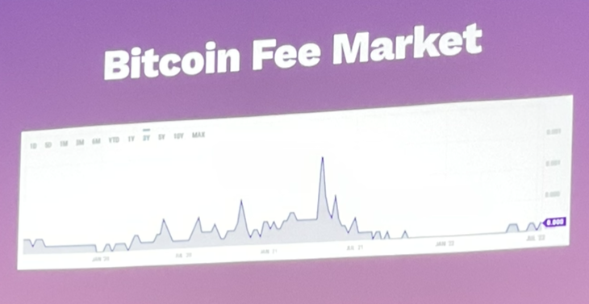
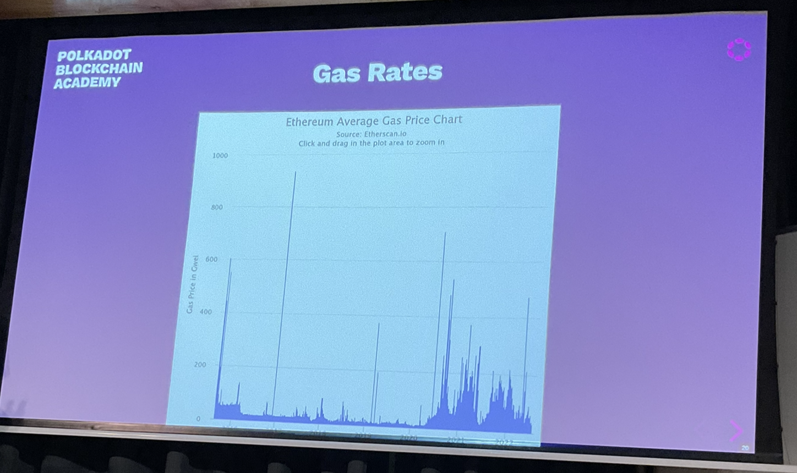

# Fees, Ordering and Bridges

Joe Petrowski

## Overview

1. Fees and ordering
2. Execution models
3. Bridges

## Fees & Ordering

Blockchains are shared open systems. Unrestricted access but restricted resources.

Hence it is not free to access.

## Threads

A blockchain runtime is single-threaded (for now).

Nodes and networking can be done in a multi-threaded manner.

## Time

A block must terminate in some some amount of time

## Network

Besides execution time, blocks need to propagate throughout the network.

## Demand

Many people want to use the system concurrently.

Hence the system needs to decide:
- Which state transition calls to include in a block
- How to order them

## Brief Interruption #1

The block body contains an ordered set of extrinsics.

These packets include:
- A call to the system's state transition function
- Some contextual information such as spec version
- Perhaps some additional information that would help block authors prioritise


wiki.polkadot.network/docs/build-transaction-construction

## No-Longer Brief Interruption #1

consider packets with:
- zero signatures attached as "inherents" or "unsigned extrinsics".

## Fee Models

- Size (bitcoin)
- Step Metering (ethereum)
- Time (polkadot) *(and coming soon space)

## Size

Bitcoin has a very simple STF: Namely verifying signatures and reassigning UTXOs.

It's block size is limited and each transaction has some byte-length (instruction, signature, etc.)

Block authors will normally choose the set of transactions that would yield the highest gross fee.

## Bitcoin Fee Market



As traffic goes up, fees increase.

It works like a market with supply and demand.

## Metering

Ethereum has a more complex STF than Bitcoin, namely one that is quasi-Turing-complete.

Users could submit transactions with an unknown number of steps to terminate.

The system uses "gas metering" to halt execution of a transaction and continue to the next.

Ethereum's STF defines a VM with instruction set, where each instruction costs some "gas".
Users specify:
- Max amount of gas to use
- Cost, in ETH, per unit of gas they are willing to pay

EAch time an instruction is executed, the system deducts its cost from the max gas.

If the program terminates, it only charges for the gas used.

If it runs out of gas, it terminates the program.



- EIP1159 - new way to price gas

## Weight (substrate)

Instead of metering during runtime, meter ahead of time.

Charge a fixed* fee for dispatching some call.

Smart contracts are really good at letting untrusted people run untested/untrusted code.

You don't really have to have a concept of a trusted function.

However if you are building a blockchain, your functions are trusted.

The idea behind weight is that we can charge some fixed fee ahead of time, executing it ahead of time, using the pallet weighting system to measure the fixed fee for all future calls.

```rust
#[pallet:weight(100_000_000)]
fn my_variable_weight_call(input: u8) -> Refund {
  let mut refund: Refund = 0;
  if input > 127 {
    let _ = do_some_heavy_computation();
  } else {
    let _ = do_some_light_computation();
    refund = 80_000_000;
  }
  refund
}
```

This is used in the modules that are not smart contracts.

Smart contracts will work in a more gas metering way.

So:
Using weight reduced the overhead of runtime metering, but requires some more care from developers.
- You have to be able to meter before runtime
- SO, users should not be able to deploy untrusted code
- There is no safety net on execution
- Some computation is OK, but should be possible from call inspection

## Time

Weight is picoseconds of execution time (10E-12).


Calls are benchmarked on some "standard hardware".

(There are some changes in the works about making two-dimensional weight).

## Brief Interruption #2

Some of the gas and weight systems are evolving:
- Ethereum recently added EIP1559, which uses a fee + tip mechanism
- Parity and Web2 Foundation are discussing some changes to the weights model

## Fee Strategies

Block authors can include transactions using several strategies:
- Just take those with the highest fee
- Take a gas/weight ratio or similar

## Fee Burning

Not all the fees must go to the block author (depends on the system design)

In fact, this is often a bad design. Block authors will want fees to go up, so may indulge in no-op transactions to boost fees.

We can send 20% to a treasury or similar.

If you send all the fees to the block author. It creates a market for transactions that can drive up fees. A miner could send loads of transactions with high fees to drive up the price.

- Polkadot gives 20% of fees to block authors and 80% to an on-chain treasury
- Since EIP1559 in eth some is burnt.

## Filling a Block

Depending on the limiting factor, systems can have different limits to call a block full:
- btc - Size
- eth - Gas
- dot - Weight

## Priority Basis

Many small transactions might result in a higher fee for greedy block authors.

So there could exist a set of transactions that is more profitable than just the top `N`.

Even some that could be considered attacks.

## Transactional Execution

Most blockchains have a transactional execution model.

That is they need to be woken up.

A smart contract, for example, won't execute code unless someone submits a signed, fee-paying transaction.

## Brief Interruption #3

All of the packets from the outside world in these systems are signed.

## Free Execution

State machines can have autonomous functions in their state transition function.

System designers can make these functions execute as part of the STF.

In this model, block authors must execute some logic.

These added function calls are powerful, but some care must be taken:
- They still consume execution resources (e.g. weight)
- The ye need some method of verification (other nodes should bea ble to accept/reject them).

## Hooks

The Substrate lectures will get into these, but for now just look at some APIs:

```rust
pub trait Hooks<BLockNumber> {
  fn on_finalize(_n: BlockNumber) {}
  fn on_initialize(_n: BlockNumber)...
}
```
Source: /frame/support/src/traits/hooks.rs

## Bridges

### Transport

Bridges are a transport layer between independent consensus systems.

Parachains are not independent consensus systems. They both rely on polkadot consensus.

Polkadot and Ethereum are independent consensus systems. A bridge would allow transfer between the two systems.

### Forms

- On-chain light client bridges place some logic on one chain that can verify the state of another
- Collateral-based bridges trust entities on one chain to hold assets as collateral for those on another

### Game Theory

There is also quite a large game theoretic design space with bridges.

They often have their own participants separate from the participants in either consensus system.

### Using Bridges

- Best case: don't.
- OK case: A bridge with some consensus verification means
- Worst Case: Collateral based bridges.

## Next

We discuss how to attack these.

## Other Notes

You have consensus over the state and blocks.

You don't have consensus of the pending transactions.

## Questions

Why would you run an RPC node?

