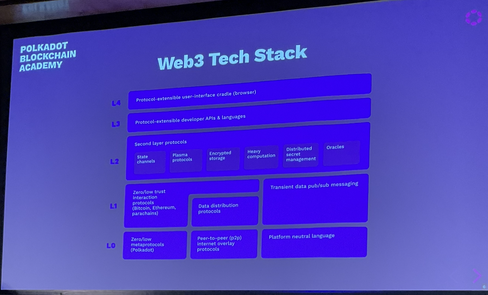

# Unstoppable Applications

Web3 should prioritise people over platforms.

## Criticisms

- Mining pools
- RPC providers
- Bridges

## Network Level

### Network Attacks

- Entry nodes and peer discovery
- Data center faults
- Traffic analysis and targeted takedowns
  - AWS decides to close your node

## Consensus

- Mining pools
  - no finite bound, anyone can join
  - people like to organise
  - we don't want authority sets to organise

## Security Dilution

- Centralised: cost of corruption/influence
- Proof of Work: Number of CPUs in the world
- Proof of Stake: Value (by definition, finite)

Consensus systems in general are all competing for security and they have reason to attack each other.

Emergence of obscure/niche "Proof of X" algorithms to shelter from attack only goes so far.

## Provability

Some types of misbehavior are harder to prove than others.

Equivocation is simple: Someone can just produce two signed messages as cryptographic proof.

Others rely on challenge-response games and dispute resolution.

## Validator Consolidation

How many validators does a system need?

Higher numbers should lead to a decrease in the ability for entities to collude.

But validators are expensive.

## Authority from accountability

Authority should imply accountability.

No matter how you design an authority selection mechanism, some people will have a privileged position within it.

Those who *choose* to become authorities should be liable for their actions.

Polkadot is weighted by one node, one vote.
Polkadot has super-linear slashing. The more nodes that act maliciously, the higher the slashing level.

There are validator as a service operations.

## Polkadot Pause

A few interesting design decisions in Polkadot w/r/t its architecture:
- More validators increase the state transition throughput of the network.
- Individual shards have full economic freedom by being members of a larger consensus system.
- Super-linear slashing puts colluding validators at existential risk (while well-meaning ones should have little to worry about).

About 5 validators are needed per parachain.

Parachains are a way to outsource validation.

## Network Access

In web2 any cryptographic guarantees are between authority and user.

In an ideal case, application users would run nodes themselves, so as to not trust a provider.

But nodes can consume large amounts of storage, network and CPU resources.

Hence we end up having to trust the node 'service providers'.

If running one node is difficult, imagine trying to run multiple nodes for multi-chain interactions. This is almost impossible to do at home.

## Light Clients

Light clients only store block headers and consensus-critical information.
- Allows users to query full nodes from RPC providers
- but take advantage of hash-based data structure to verify the information coming from a provider
- Low storage and bandwidth requirements (use in a browser extension or mobile device).

## Validator Power
### STF Upgrades

Validators all execute the state transition function.

### Hard Forks

Traditionally all nodes need to upgrade their software to apply any upgrades.

This gives node providers huge power: Even if every other group wants to make a change, "authority nodes" can refuse to upgrade.

If the chain does split into two, who decides which chain is which?
- Greater hashpower or value at stake
- Whatever is recognised by service providers
- Whatever is recognised by data aggregators

**But not the stakeholders of the system**

### Transaction Censorship and Ordering

Block authors choose the transactions orders

### Censorship

All nodes can censor but still uphold the expectation that the system is available to everyone.

As long as no transaction is the intersection of the censored sets.

Deterministic finality helps as you are forced to build upon the previous block.

### Miner Extractable Value

A measure of the value that block authors can extract based on their knowledge of pending transactions and ability to order them.
- Frontrunning
- Backrunning
- Sandwiching

### Revisiting Transactional and Free Execution

Transactional execution means that logic must be woken up by transactions.

Free execution provides more power to application developers to deliver behavior guarantees. Function calls can be scheduled and automatically dispatched. Uses include...

### Separate Consensus Systems

Two consensus systems may have differing levels of security and definitions of finality.

### Reversions

If you have two chains with independent consensus mechanisms, one has deterministic finality and the other probabilistic finality, then the deterministic one needs to remember the probabilistic one could go back on its word.

## Blockchain Wars

Systems with high security have the incentive to attack systems with low security whom they perceive as competitors.

Likely in the future there will be a 5-10 big networks that have a lot of security and bridges between them.

## Trustless Messaging

In order to handle messages without trust systems must share finality.

## A Note on Synchronicity

Smart contracts on a single chain can interact trustlessly because of their shared view of finality.

Asynchronous systems can also share finality (i.e. be members of the same consensus system).

## Wrap Up

End of Module 3. Goals is that you now have the primitives and concepts necessary to dive into Substrate and Polkadot and start building unstoppable Web3 applications.
