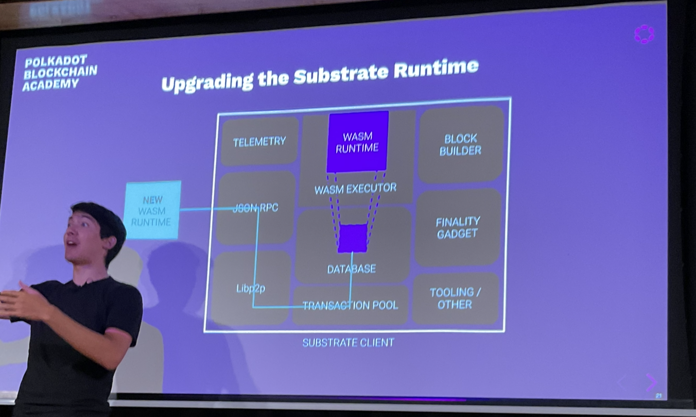
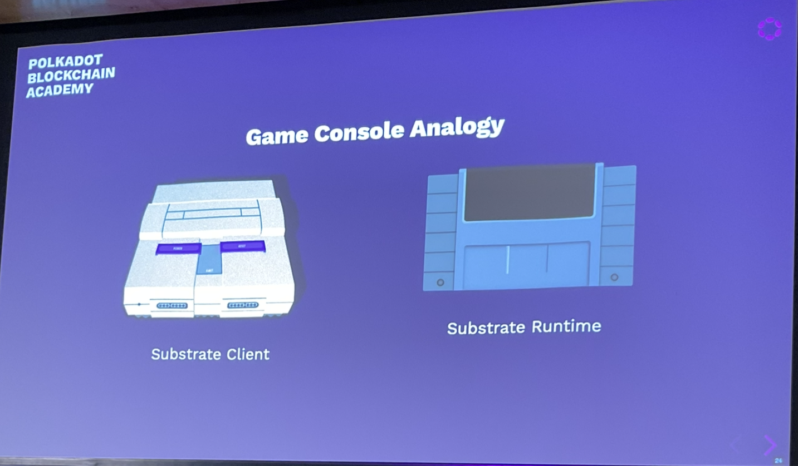
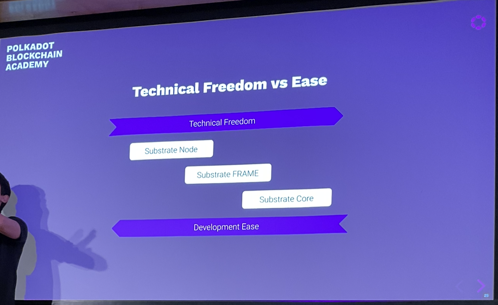
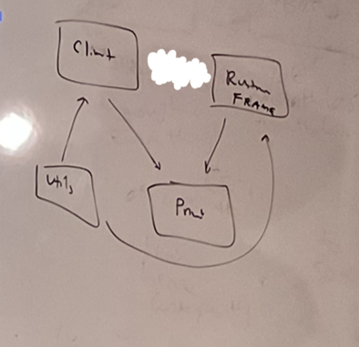

# Substrate

## What is Substrate?

Substrate is a rust framework for building modular and extensible blockchains.

## Why Substrate?

Building a blockchain is hard.

## Why Rust?

Check out: https://www.parity.io/blog/why-rust

Rust is:
- safe
- fast
- lightweight
- idiomatic
- fun

## Substrate Architecture

At a very high level, substrate has 2 parts:
1. The Client - A Wasm executor
2. A wasm runtime

## What is the runtime

It is the state machine for the blockchain.

The runtime is a turing-complete state machine
- The state machine itself is broken into two components
  - The state itself
  - The state transition function

## STF

Things that transition state:
- messages from the outside world
  - e.g. transactions from users
- automated onchain logic

## Runtime as a VM

The runtime is designed as a virtual machine within the substrate client.

Why?
- runtime code must execute deterministically
- runtime code should be sandboxed

VMs enable this.

The runtime is always a **Wasm** binary.

## Wasm

WebAssembly
- It is a binary instruction format for a stack-based virtual machine.
- originally built for faster JS sites
- It is an open standard

### Why Wasm was chosen?

- Compact
  - designed to be easily transferred over the web
- Sandboxable
  - keeps it safe
- Deterministic(-ish)
  - assuming all outputs are defined given some instruction set.
- Performance
  - direct mapping of operations to machine code
- Well Supported
  - it is becoming a core part of the web like javascript

## Substrate Wasm Assumptions

- We use the wasm mvp (versus 1.0 spec)
- uses the `wasm32-unknown-unknown` target
- maximum amount of addressable bytes is 4gb
  - substrate only allows the runtime 128 mb
- Avoid using `std` libraries in the runtime
  - Prevents most "footguns".

## Wasm Execution

two executors:
1. Wasmi
   - wasm execution via interpretation (vs compilation)
   - 100x slower than native execution
   - used for smart contract execution
2. Wasmtime
   - compiles the wasm (makes it vulnerable to compiler bombs)
   - 2x slower than native execution
   - used for runtime execution

## Runtime Assumptions

To make a Substrate compatible runtime, our only assumptions are:
1. It exposes a specific Runtime APIs.
2. It has access to specific client-side host functions

## The Client

- This is simply the natively compiled binary which runs on your computer.
- It has access to do much more things then the restrictive Wasm VM environment.
- Generally determinism is not important at this level (only in the runtime)
  - Allows multiple implementations to be created
  - Allows for compilation to different targets.
- You can use std on the client

## Client Assumptions

- performance of the client should be the same
  - Most relevant for block producers (which do the most work)
  - Usually this means similar computer hardware and binaries.
  - This ensures blockchains reach consensus in a similar amount of time.
- Also the same requirements for providing Host Functions and accessing Runtime APIs.

## Client Components

- Networking
- Database
- Transaction Queue
- Consensus
- Telemetry
- Wasm Runtime
- tools
- And more!

The Wasm is stored on chain.

## Wasm Runtime

Hard fork problem - Not everyone updates their client software in time.

In dot, we can update the Wasm runtime and everyone automatically to update.

Consensus is unique as some of it is handled in the runtime, and out of the runtime.

The runtime was made primarily responsible for the STF as that is the part that is expected to be the part people will want to innovate on and update/change.

The runtime is single threaded.

## Technical Freedom vs Ease

- Substrate core is very difficult - build the gaming console.
- Substrate FRAME - middling - build games.
  - the language of the runtime 
- Substrate node is easy - play the games

## License

Most is under `Apache 2.0` - free to use.
Substrate Client is licensed under `GPL v3.0 with a classpath linking exception`. Any changes you make here you must not sell in a closed source way.

## Exercise 1

1. Clone and open `Substrate`.

Substrate main components diagram:

## Questions

What is telemetry?
How do you store the Wasm on chain?
The state transition function is determined by the runtime?
How is it decided to update the Wasm runtime? Can I propose an upgrade? Is it done via governance?

