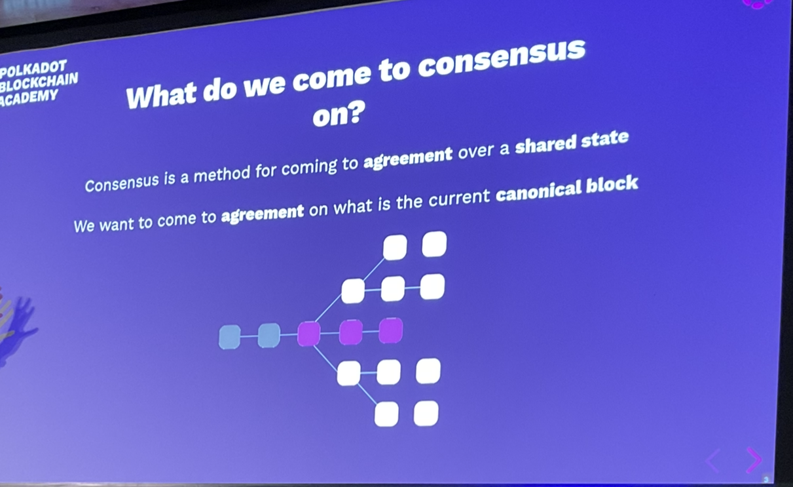
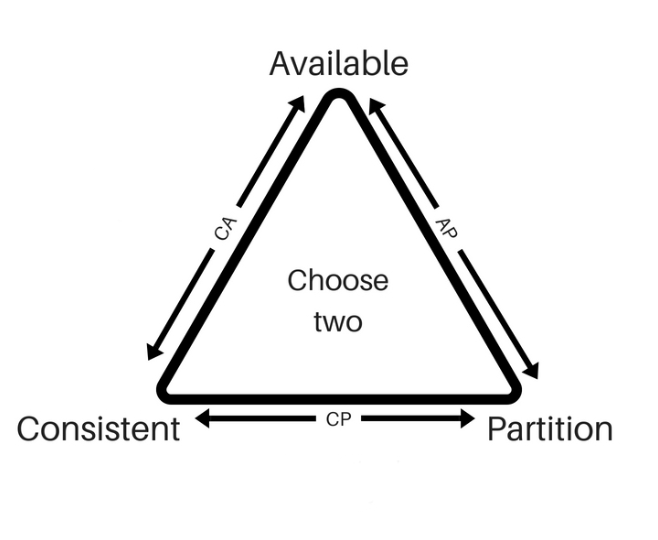
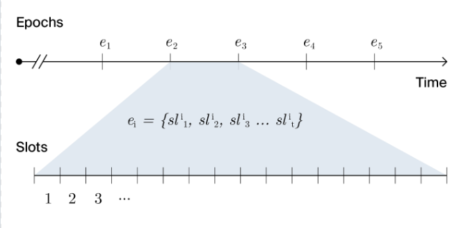
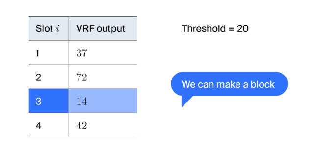
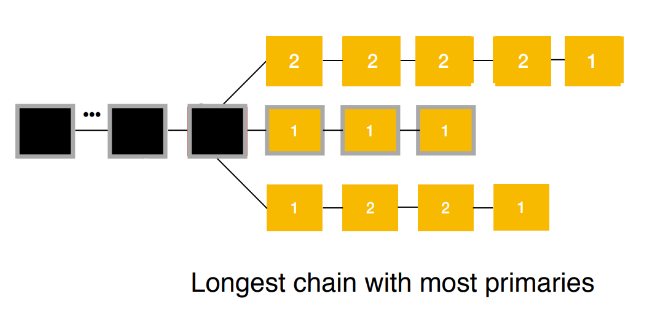
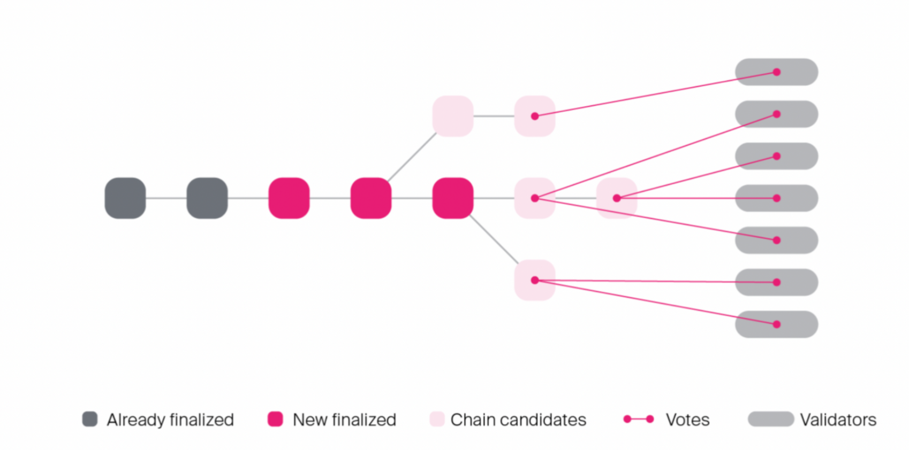

# Consensus

Block Authoring and Finality

## What is consensus

The blockchain as a state which updated by executing the state transition function.

We run the STF by creating new blocks (block execution)

- How do we decide who gets to author the next block?
- How do we reconcile diverging views of the current state?
- How can we be sure that a certain state is canonical and will never be reverted?

## What do we come to consensus on?

Consensus is a method for coming to agreement over a shared state. We want to come to agreement on what is the current canonical block.



## You are Here

Written in Rust, compiled to native code, doesn't deal with native code at all.

## Fork choice

Given or two or more different diverging states, how do we choose which is the canonical fork?

We call this the fork choice rule, and different protocols have different rules for how to chooose a different fork.

## Finality

Given a certain state/block how certain can we be that it is canonical?

If we're certain that a block is canonical we consider it ot be finalized.

This property can either be:
- Probabilistic
- Definite/Provable

## CAP Theorem

- Available
- Consistent
- Partition tolerant

You can only choose two.



## Proof of Work

- Hard to generate the proof
- Cheap to verify
- Not a consensus mechanism by itself

## Nakamoto Consensus

Anyone can extend the blockchain: to do so requires a proof that a certain amount of work has been completed.

Given a fork, always follow the longest chain.

The PoW is a Sybil deterrence mechanism.

Sybil attack - If it is cheap for you to create a new identity, then I could create a million nodes.

It is a stochastic process weighted by the relative computational power of participants.

The fork choice rule allows the participants to eventually reach consensus.

Finality is only probabilistic.

Possible attack - hardware producers not releasing the latest hardware and secretly using it for a mining advantage.

## PoW in Substrate

Substrate ships with a nakamoto consensus implementation.

It doesn't implement any specific PoW algorithm: users of the framework can plug their own.

Kulupu is a project built on Substrate that uses PoW-based consensus.

They use an algorithm that is designed not to be fast on asiics.

## Moving away from PoW

Due to environmental/waste concerns.

## Slot-based block authoring

Unlike PoW we must have a closed set of authorities with known identities.

We discretize time into slots and a t each slot we have a protocol to decide which of the authorities is entitled to author a block.

### Aura (authority-round)

At each slot the authorities are chosen in a round-robin fashion:

```
authority(slot) = authorities[slot % authorities.len()];
```

1. The chosen authority is allowed to issue no more than one block during that slot
2. The longest chain is followed

This is not really very secure.

- Pros
  - Not wasting energy
  - simple to implement and reason about
- Cons
  - Attackable since the full schedule of block production is known in advance
  - You can preemptively attack the next block author to censor it using a DDOS attack.

Forks can only happen during a network partition.

If the block author produces a false block, the other validators would ignore it.

## Slots, but more like PoW?

We want to have a slot-based block authoring protocol that has similar properties to PoW. Namely that we don't know who the next block author will be.

We want the slot assignment to be a stochastic process... but without the wasted energy.

## ...see an RNG?

```
threshold = 1 / number_of _authorities
should_author = rng(seed) < threshold
```

This is similar to what is happening with PoW. The threshold is weighted by computation power.

- How can we make sure that the random number generated by an authority was legitimate?
- How can we use randomness in the face of a deterministic execution environment?
  - We use VRFs

## BABE

Blind Assignment for Blockchain Extension

BABE is a block production mechanism inspired by the Ouroboros Praos protocol

A slot-based block authoring algorithm using a VRF for assignment. Nobody knows who the slot author is until they prove it.

A deterministic fallback mechanism ensuring there will always be a valid slot author.



- Each slot can have a primary and secondary author (or slot leader)
- Primary slots are assigned randomly using a VRF
  - If multiple are published there is a fork
- Secondary slots are assigned deterministically (this is a fallback if the primary slot is not produced)

In practice only 25% of slots are primary in Polkadot.

The current slot is a function of real-world time:

```
current_slot = current_unix_time / slot_duration
```

## Primary Slots

At each slot authorities evaluate the VRF

VRFs generate a psuedo-random output along with a proof that it was properly generated

```
slot_author(slot, private_key) = vrf(seed, slot, private_key).output < threshold
threshold = 2 ^ vrf_output_length * (1 - (1 - c)) ^ ( 1 / number_of_authorities)
c is a constant 0 <= c < 1
```



## Seeding the VRF

As with any RNG the VRF needs to take as input some random material (the seed)

We need to generate random material in a deterministic fashion.

As an epoch progresses every VRF output used a by a primary slot is stored.

At the end of the epoch the stored data is concatenated.

We hash this data and use it as the seed for a future epoch.

In short we take all VRF outputs for a given epoch and hash them together to produce the seed for the a future epoch.

The randomness computed at epooch N:
- is announced at the beginning of epoch N + 1 (along with the authorities)
- And used on epoch N + 2

Randomness collected during epoch 1 is announced to be used in epoch 3

## Primary slots

As with PoW the process of slot attribution is stochastic.

Any slot can be assigned to 0,1 or more validators

Having unassigned slots leads to variability in block time, as no authority will be able to produce ab lock on that slot.


## Secondary slots

In order to avoid empty slots we assign all slots to a secondary validator

```
secondary_slot_author = hash(epoch_randomness ++ slot_number) % authorities.len()
```

This mechanism guarantees a consistent block time assuming the secondary slot holder is reliable.

## Block predigest

```rust
pub enum BabePreDigest {
  // A primary VRF-based slot assignment
  Primary(PreDigest),
  // A secondary VRF-based slot assignment
  Secondary(PreDigest),
}

// This gets attached to the header -> the runtime will see it
// this is needed e.g. for when we are seeding the VRF which is collected within the runtime.
// When executing a block, the VRF will take this output and use it to create the next seed for VRF randomness.
pub struct PreDigest {
  pub authority_index: AuthorityIndex,
  pub slot: Slot
  pub vrf_output: VRFOutput,
  pub vrf_proof: VRFProof,
}
```

A piece fo data created by the consensus protocol and added to the block before it gets executed. This is mainly used to pass consensus-related information into the runtime.

## Block Seal

A digest that gets added to the block after execution.

It should serve as an extra proof that the given validator in fact created that block.

It's usually just a signature of the hash of the block header.

## Fork choice rule for BABE

Instead of following the longest chain. We want to follow the chain that has the most primary slots
- since these are the most secure slots
- Secondary slots can easily be censored



## Provable finality

All consensus protocols presented so far only provide probabilistic finality.

A BFT consensus protocol will achieve provably/instant finality as it is strongly consistent.
- Given N validators it requires 2/3N + 1 validators to come to agreement
- O(n^2) communication complexity

## Hybrid consensus

INstead of making the block authoring protocol BFT tolerant, we create a gadget to perform BFT agreement on top of an already existing blockchain.

- Participants of the protocol will vote on what they believe is the best chain
- i.e. what should be finalized
  - This way we use different protocols for block authoring and finality:
- Block authoring - eventually consistent, favors liveness, fast
- Finality - strongly consistent, slow

## GRANDPA

GHOST-based Recursive ANcestor Deriving Prefix Agreement

GHOST = Greedy Heaviest Observed Subtree

The protocol progresses in rounds.

Every round the validators are required to do two-phases of noting: prevote and precommit.

At the end of every round participants are guaranteed to reach consensus on what block finalized. Potentially teh same block that had been previously finalized.



If you vote for a block, you implicitly vote for all its ancestors.

## A GRANDPA Round

Each validator broadcasts a prevote for the highest block they believe to be finalized.
- If the supermajority of validators are honest, this block must extend the the chain that was previously finalized.
- This new chain could be several blocks longer than the last finalized chain.

We define the round estimate as the highest ancestor of the prevote GHOST for which it is still possible to precommit.
- i.e. when no precommit votes have been sent out yet, then:
```
estimate == prevote GHOST
```

The round is deemed completable:
- If the estimate is lower than the prevote GHOST
- Or if it's impossible to have a supermajority on any block higher than the current estimate

Validators start a new round after it becomes completable.
