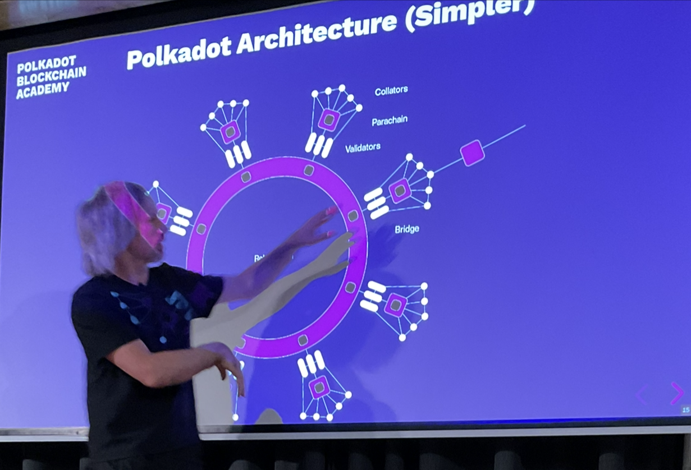
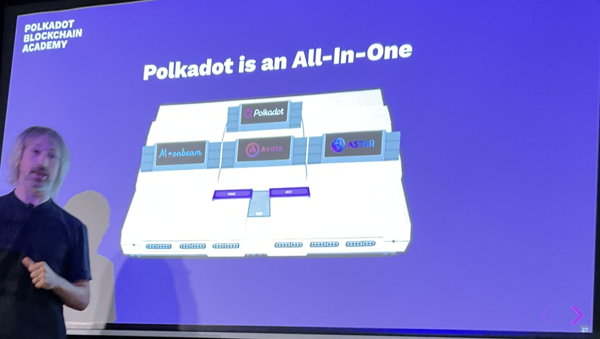

# Polkadot

A scalable heterogenous sharded multi-chain network.

- sharded multi-chain
  - a non-sharded multi-chain is a serialised transaction processor
  - a multi-chain is one that has many linked list and at some point those linked lists amalgamate
    - this happens every block in polkadot
    - this means the chains can message each other
      - one of the key points of sharding is to allow the shards to work together
- heterogenous
  - each shard is not necessarily the same kind of thing
    - do not necessarily process the same logic

There was something called namecoin, which was about a name registry. People could own names, a bit like nfts. You could do the same thing on btc/eth, however it was a bit easier and more performant/efficient on namecoin.

The shards can be specialized.

## Polkadot is a Layer 0 Blockchain

- Layer 3
  - An application or platform which is hosted by an L2.
    - Not much difference between this and layer 2.
- Layer 2
  - An application or platform which is hosted by an L1.
- Layer 1
  - A basic blockchain which administers a native token and hosts one or more applications.
    - E.g. btc/eth. Primarily it is not a consensus provider.
- Layer 0
  - A secure consensus-provider. A pure L0 has no ability to host applications. An impure L0 may be able to host limited fixed-function applications (e.g. token hosting), but is primarily used to host other blockchains.
    - According to Gavin Wood, there are no pure L0s.

Polkadot is an impure L0, because it has a token. The processing done on this network is primarily done to host other blockchains. Over time polkadot is expected to become more and more pure.

These are slightly blurry marketing terms.

## What is Polkadot Trying to Solve?

3 core problems:
1. Scalability
2. Interoperability
   - Different types of things - we provide communication between these different things (parachains).
   - Other definition is external interoperability. Being able to interoperate with other blockchains e.g. eth.
3. Shared Security
   - Most consensus/security systems are a zero sum game across different consensus systems
     - E.g. Ethereum/Ethereum Classic.
       - You could argue this is scaling solution, together they can process double the traffic if you setup a bridge.
       - Problem is, if you have a mining farm (ignoring merge mining) you can only secure one of the networks.
       - This problem becomes even worse when you switch from proof of work to proof of stake.
         - As you divide up into many pos networks, you split up and breakdown the security level.

## The Value of Scalability

The goal:
- Provide enough transaction throughput so that 8 billion people can use the network.
  - Say that people make 1 transaction per minute of economically strong transactions (e.g. > $100)
    - An economically weak transaction would be pressing a like button
    - An economically strong transaction might be buying a house.

## The Problem with Scalability Today

- Btc: Limited in abilities.
- Eth: limited in transaction bandwidth
- Other single Chain Solutions: same fundamental problem as Ethereum.
- Layer 2 Solutions: Likely leads to centralization risks

Single chain is like single threaded, eventually you need parallelisation.

## Specificity Leads to Scalability

Systems which try to do everything will not do anything the best.
Generalized blockchains like Ethereum are not optimized.
Heterogeneity is the way.

## The Value of Interoperability

Specialized blockchains rely on each other to provide real world value to end users.

Users want to complete complex end to end scenarios, and will use multiple specialized blockchains to do that most efficiently.

Connecting new and existing ecosystems provides users with effortless access to the growing Web3 ecosystem.

- One set of legal people in the UK are solicitors.
  - These tend to do paper work.
  - Need to get permission to go to high court.
  - Can be employees of a company.
- The other half are called barristers.
  - They tend to go to the higher courts.
  - Not allowed by law to be employees (to stop syndicates forming etc.).
    - However they tend to form into cliques/groups.
    - These groups are not allowed to be companies.
      - They are called chambers. They socialise and help each other.
      - They pay for the office space. It is a big thing to become a resident at a chambers.
      - It's a big thing to join a prestigious chambers.
      - Because they don't work for the same company, they have a limited ability to transact with one another.
      - Whereas with solicitors, the client deals with the company, and the company can divvy it up however.
      - With barristers, the client doesn't go the chambers, but to the barrister directly.
        - This makes it difficult if a barrister wants help from another barrister.
          - You could even say insecure in terms of NDA agreements and so forth.

In some sense the difference between the barrister/solicitor situation is one of interoperability.

Polkadot allows its shards and chains to talk to each other without needing the user in between.

## The Problem with Interoperability Today

- Differences in fundamental protocols means blockchains cannot talk to each other:
  - Cryptography
  - Networking
  - Proofs
- Custom bridges is an exponential problem: O(n^2).
- Bridges do not provide economic security between chains.
  - If one chain forks, the other chain cannot undo what it has done based on what it thought the other chain had done.

## The Value of Shared Security

Blockchains require economic incentives to build and secure the chain.

Shared security can help reduce the total economic burden to provide security to many blockchains.

## The Problem with Multi-Chain Security Today

- Bootstrapping problem.
- Tokens often provide no utility or value.
- Inherent competition of resources.

Today it is mostly "ponzi-nomics".

Consensus security as a service.

## Polkadot Architecture (Simple)

- Relay Chain
  - The heart of polkadot
- Parachain
  - Sovereign in so much as it can control its own business logic.
  - parrallelised chains = parachain
- Parathreads
  - Similar to parachains, but when they get executed at a different rate.
  - There is an assumption that parachain will execute a block at the same rhythm as the relay chain.
    - In terms of CPU, this is like putting one process on each core.

Polkadot can in principle execute 100 parachain cores. It either only do 100, or we can have more than 100 parachain cores, and we can switch in and out of them. What is the scheduling model - round robin, pay as you go.

## Nominated Proof of Stake

Polkadot uses an NPoS system to collect and select network participants to secure teh network.

Those who are selected will use their DOT token as collateral for doing their job correctly. Good actors will be rewarded, while bad actors will have their collateral slashed.

We choose a set of validators who we believe will be honest and competent. We pay them to do the job well, slash them if they f up.

## Nominators

Secure the Relay chain by selecting trustworthy validators and staking dots.

It is usually sensible to allow for the possibility for others to come together with the node operator to become a validator.

If there is a £30k deposit, 30 people with £1k can come together.

There is a nomination market. A validator can say I will run a node, and I will take a 5% commission. Back me and I will share the rest with you.

## Validators

Validators are the ones who actually run the nodes.

## Collators

These people create new blocks on the parachains. They keep the relay chain synchronized with the parachains. Specific to a particular parachain. They provide with the parachain block a proof that allows the relay chain validators to be sure that the collators acted honestly when they collected the parachain block/blocks.

Essentially provide validators with parachain proofs so they can by synced together.

## Parachain Validation Function (PVF)

Our auditors (validators) need to be able to audit any kind of parachain. Wasm is used as a universal for this. The Parachain validation function must be able to work with proofs.

This PVF includes all of the logic to work the proofs as well as the runtime.s

Validators can verify the state transition of any Parachain given 3 simple pieces of data:
- The Parachain's Wasm Runtime
- The Parachain's Block
- The Parachain's State Proof (Proof of Validity)

## Polkadot is an All-In-One

The games console analogy - taking it further.

Polkadot used to be a permissioned network.

We were able to make it permissionless by switching out the polkadot cartridge.

## Mechanics of Parachain Validation

Imagine:
- 1,000 Validators
- 100 Parachains
- 10 Validators per Parachain
- Random Assignment of Validators
  - Every 5 or 10 blocks to a new parachain (there a cost to this switch, compiling some new Wasm).
  - Because of this frequent switching, an attack on one parachain is an attack on all chains.
    - This is a differentiator from other multi-chain systems.
- Disputes Reporting
  - If a validator catches another validator doing something wrong - then we have a dispute. If everyone is benevolent and there are no bugs, there should be no disputes.

We are able to derive strong security guarantees while splitting up our validators across different parachains.

## XCMP

Cross-Chain Message Passing.

Parachains can talk to each other without going through the relay chain (this hasn't been built yet).

## Horizontal Relay-Routed Message Passing (HRMP)

Also known as XCMP-lite.

- A temporary solution for enabling parachains to communicate with each other.
- Channels must be explicitly opened by parachains that want to communicate with one another
- Long term, truly P@P XCMP messages will be enabled.

You have to pass these messages via the relay chain.

## Vertical Message Passing (VMP)

- Upward Message Passing (UMP)
- Downward Message Passing (DMP)

## Bridges

These do message passing without shared security (problem of weak chain vs strong chain).

Allows parachains and parathreads to connect and communicate with eth and btc etc.

## Economics of Polkadot

### DOT Token

3 core utilities:
1. Governance
   - How should the business evolve?
   - Complete control of the protocol and its evolution
2. Staking
   - How we secure the network, the incentive scheme to secure the network.
3. Bonding
   - This means parachain leasing. This is the really important thing that it is used for.
   - Currently works on a 2 year leasing schedule.
     - These rules will likely change e.g. pay as you go parathreads.
       - You can upload a parachain and have the parachain for itself to advance.

### Relay Chain fees

- Auto adjust based on traffic on the relay chain.
- 80% go to the treasury
- 20% to the block producer.
- Can give a tip to the producer.

### Token Inflation

- DOT tokens inflate at ~7.7%
  - By default 10%, but some gets burnt that is not used by the treasury.
- New tokens used to incentivise the validators
- Inflation is hedged against the exponential growth and value add of the network.
- A percentage of DOT tokens in the treasury are burned if they are not allocated to public projects.

### Parachains Operate Feelessly

- Parachains pay no fees beyond their initial DOT bond, which is returned in full at the end of the lease period.
- Block execution message passing and shared security come at no additional cost over time.
- Parachain slots can even be given away for free via governance (common good parachains).
  - These are like system parachains. They don't have to put down a bond.
    - They are not allowed their own token, they have to use the DOT token.
- Enables all sorts of Web3 systems which would not exist in a fee-based economy.

## Substrate

Polkadot is built with Substrate. Polkadot and parachains will get the benefits of this evolving toolset.

## Runtime Upgrades

38 Runtime Upgrades So Far!

## Kusama

A "chaotic", value-bearing canary network for the POlkadot ecosystem.

Allows us to test out logic and pre-audit results. No guarantees are there for Kusama.

It is a bit of a honeypot for hackers to attack.

## Rococo

A stable, non-value-bearing test network for parachain teams and the developer community.

## Treasury

Polkadot ensure that a portion of all network fees are spent in service of the network

## Governance V2

- New governance system (Gov2) near release.
- 50% of total tokens, with enough conviction, can decide the fate of the chain.
- No "first class citizens", like Council or Technical Committee.
- Simply one decision-making mechanism: the public referendum.
- Origins and Tracks
  - Tracks allow many different referenda to be taken on their track, or only one or two.
    - Can control safeguards like time limits before it can approved.
  - Origins of varying power levels.
  - Variable number of tracks based on origin.
- Multi-role Delegation
  - Different votes being delegated to different people.
    - Small payments from the treasury might be delegated to one person.
    - Runtime upgrades you might be able to delegate to another person.
- Fellowship and Whitelist

## Super-Scalability

- Polkadot Cubed
  - A research project that aims to scale through having multiple relay-chains with the same validator set.
- Blitz Chains
  - Second level parachains.
    - The parachain can be a relay chain and host it's own parachains.
      - This can offer exponential scalability.
      - Tradeoff with security, perhaps good for light transactions (e.g. likes)
- Non-Persistent Trie
  - Use the GPU and avoid storing any merkle nodes on disc.

