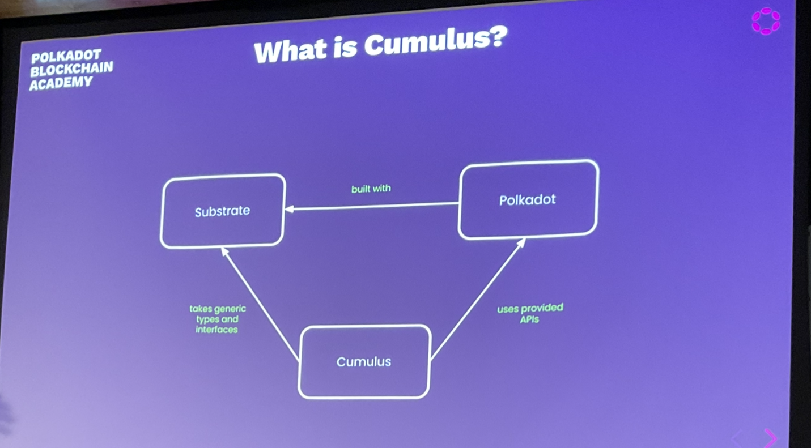

# Cumulus

pvf = parachain validation function
upward messages => to the relay chain
downward messages => to the parachain

## Outline

1. What is Cumulus?
2. Cumulus Validation Blob
3. Cumulus on the Node Side
4. Transform solo to Parachain

## What is Cumulus?

- Substrate (framework)
  - Polkadot built with Substrate

- Cumulus is another framework
  - It extends the substrate framework, by adding another framework around it, so that you can build your parachain.



## Cumulus Validation Blob

### Polkadot requirements

- Polkadot requires a validation blob for verifying Parachain state transitions
- This blob is required to be a valid WAsm binary that exposes the `validate_block` function
- Wasm runtimes are deeply baked into the Substrate core protocol
- The Substrate runtime is the state transition function

## Validate a State Transition

- A Substrate chain verifies a Block state transition on import
- Importing a block is done using `execute_block`
- Executing a block means to execute the entire block with all transactions
- The input header must match the header that is the result of executing the block
- This ensures that the storage root, the extrinsic root, etc. are correct

The validation blob is stored on the relay chain. You have the runtime in your own parachain state. The validation function is stored in the relay chain state. When you register a parachain you submit your genesis block and your the validation function. The genesis state is the genesis header. PBF, the web assembly blob are the same file.

The validation of the parachain is done in a similar way to the lite client.

## The Trick

- Reuse the substrate-based runtime
- Augment the runtime with the `validate_block` function
- The validation blob stored on the relay chain & the runtime code blob stored in the Parachain state are the same.

## Cumulus on the Node Side

- Finality
- Triggering Block Authoring
- Ensure Block Availability

## Finality

```rust
loop {
  let finalized = finalized_relay_chain_blocks_stream.next().await;

  let parachain_block = match get_parachain_block_for_relay_chain_block(finalized) {
    Some(b) => b,
    None => continue,
  };

  set_finalized_parachain_block(parachain_block);
}
```

The parachain has to produce a block for all the different forks of the relay chain until one route is finalised.

## Cumulus Validation Blob

```rust
fn validate_block(input: InputParams) -> Output {
  // First let's initialize the state
  let state = input.storage_proof.into_state().expect("Storage proof invalid");

  // Run execute_block on top of the state
  with_state(state, || {
    execute_block(input.block).expect("Block is invalid")
  })

  // Create the output of the result
  create_output()
}
```

## Triggering Block Authoring

```rust
loop {
  let imported = import_relay_chain_blocks_stream.next().await;

  if relay_chain_awaits_parachain_candidate(imported) {
    // pov = proof of validity
    let pov = match parachain_trigger_block_authoring(imported) {
      Some(p) => p,
      None => continue,
    };

    relay_chain_distribute_pov(pov);
  }
}
```

## Ensuring Block Availability

- On a solo chain a block gets part of the canonical chain by:
  - Being distributed to other nodes in the network
  - Being a valid block that can be imported by a majority of the validators
- On...


```rust
loop {
  let imported = import_relay_chain_blocks_stream.next().await;

  let candidate = match get_backed_parachain_candidate_for_relay_block(imported) {
    Some(c) => c,
    None => continue,
  }

  spawn(|| {
    wait(some_time).await; // e.g. 6 seconds

    if !is_block_known(candidate.hash) {
      let pov = recover_candidate(candidate);

      let header = import_pov(pov);
      announce_block(header);
    }
  })
}
```

## Other notes

Currently, the collator nodes need to know all the state from the relay chain, but the validator nodes do not need to know all the state about the parachain.
