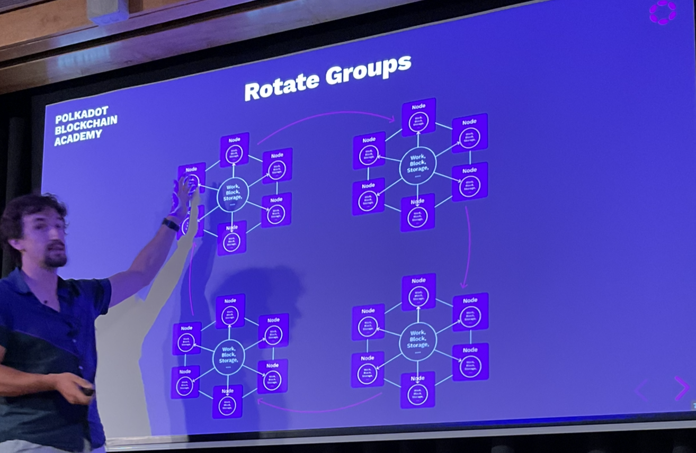

# Parachain Architecture

## Resolving Conflicts

- Security
- Liveness
- Decentralisation

## How to achieve scalability?

- Split the work
- But maintain (economic) security!
- Liveness?
  - If you only have a few nodes doing the work and they go down you are f'd

## Split the Work

You could pick the weakest one to attack, and due to the communication you could affect all the chains by doing this.

In terms of liveness, if you kill 5 of nodes, you could kill one of the chains.

Solution can be to rotate the nodes:

However this causes a new problem. Now the nodes need to keep downloading the blockchain each time they rotate.

The simplest would be to store all the blockchains on each node, but then we are back to the same scalability problem.

## Introducing Collators

These external nodes (which don't need to be trusted), they can keep the storage, so the core node groups don't have to care about it anymore.

This improves scalability even further. All of functionality and overhead is passed off to the collators. The collators can create blocks and handle the storage requirement for each blockchain.

However the nodes still need to validate the blocks produced by the collators.

Instead of the collator just providing the block

## Recap PoV - Proof of Validity

- Parachain Block Data
- Patricia Merkle Trie
  - The part of the state that is needed to produce the block.
  - We have the hash of the root of the merkle tree of the previous block state.

The validator is a form of light client to the validators.

The collator produces a block and sends it along with the prerequisite state data to the validator.
The validators execute the block to confirm that it is valid.

The collator must find which group of validators is assigned to them which is recorded on the relay chain.

## All Good?

If you have 40 validators for a parachain, then statistically speaking, the chance they are dishonest is extremely low.

The problem is performance. Worst case even liveness.

It is statistically unlikely that this group is entirely dishonest.

It also means that if 1 node doesn't agree with the rest or is not voting, we immediately have to assume it is bad.

Then we have to introduce more nodes, upgrade to 80 nodes.

This becomes a performance and scalability issue.

If you don't vote either for malicious reasons or because you are DDOS'd.

## Wait .. Bad Guys?

What can malicious nodes actually do?

They might double spend. Spam the network. Equivocate.
- It can ultimately, not faithfully execute the PVF function.
- It could manipulate messages.
- Fool light clients

## Catch Bad Guys

- Punish them.
- Gamblers ruin
  - Even if the nodes don't care about the money, they will run out of money.

## How do we do that?

An attacked could wait for all the other validators to become his friends, they start being malicious.

- 2 (3) phase process
- Validators get skin in the game (backing)
  - It is recorded when a validator says something is valid
- Check the checkers (approvals)
- Punish (disputes)

## Two Phase Process

- Backing
  - Backers check a PoV from a collator and are backing that it is correct 
- Approval
  - The approval checkers check the backers

Does this work already?

No

If you assume the backing proof is malicious.

## Three Phase Process

- Backing
  - 5 or so validators assigned to the parachain
- Inclusion/Availability
  - Proof that the data to check the backers is available
  - This information is intrinsic on relay chain
- Approval
  - Random group of validators check the backers

This works!

## But how?

- Backing group is untrusted - they could malicious
- Collators are untrusted
- We need some proof on chain that the data is available.

## Solution attempt #1

Send PoV to all validators, have them sign statements.

Works but is very costly on performance.

## Solution Attempt #2

Send the PoV to less nodes, e.g. to 40 nodes

Problems -> it is still inefficient, you have to send it to 40 nodes.

And it can be DDOS'd.

## Solution Attempt #3

- Erasure coding.

Splits up the PoV into a 1000 pieces which are sent to all of the validators.

Once the validator receives a chunk, it signs a statement saying it knows a chunk.

You only need 1/3 of the chunks to recover the data.

If you block is 1mb, you would be sending out 3mb in total, each validator receives 3kb.

## Recap

- Known backing group - get skin in the game
- Make available the PoV data
- Reveal approval checkers
- Catch bad guys
- Punish them

## Disputes

Sends out a message - someone says that this is valid, I find that it is invalid.

Now all validators of the blockchain will start fetching the data and also validate the block.

This has a performance overhead.

Need a supermajority (2/3), then if they all agree, they get slashed.

Slash Offenders - have them pay the bill.

If the block is invalid, they get slashed 100% and lose all their funds.

Hopefully this code should never run.

If you raise a false dispute, you get slashed a smaller amount.

## Summary 

- Secure heterogeneous sharding.
- Shared Security
- Performance via Specialization

## Other notes

Forks complicate this, but it was made such that no matter which fork is chosen, the slash will happen.
