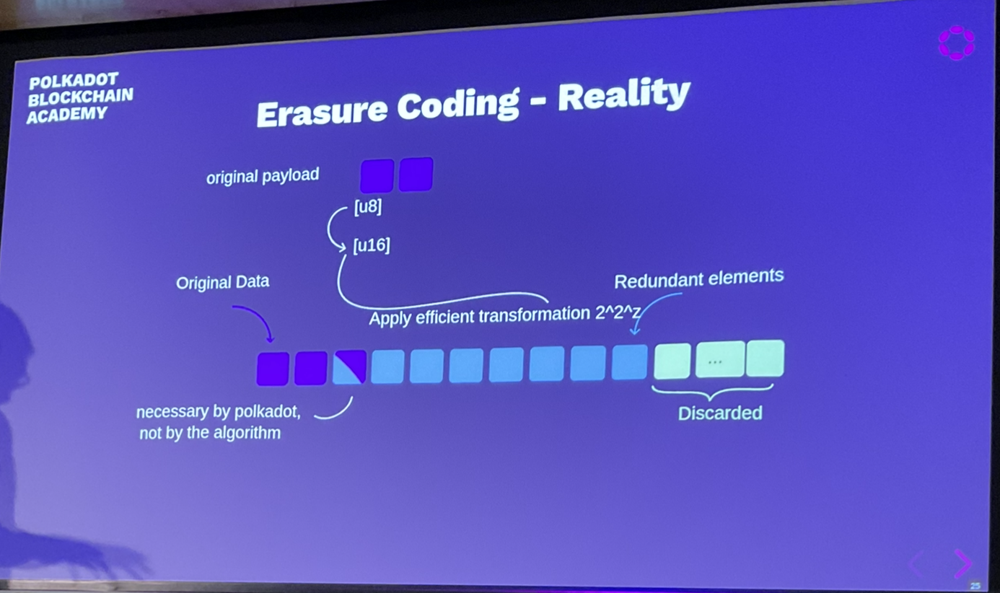

# Parachain Availability

- backing
- availability
- approval
- disputes

## Polkadot.js

Part of the `InherentData.enter`.

## Availability Revisited

- What does availability mean?
- Why do we need availability?
- Why not to just distribute the PoV?
- How large is a PoV?
  - Network Bandwidth
  - Storage on chain

We need the data to be able to be accessed.

PoVs are normal single digit MBs. This is too much.

## Bitfields

A way to compress information.

First we gossip who has which chunk available.

Then anyone can request the bits they need.

- **Compressed representation** - Gossiped availability bitfields, the candidates that are available from the point of view of one validator in the backing group.
- The number of bits equivalent to the number of `AvailabilityCores`
- Submitted on-chain

These 7 blocks represent 7 parachains.

1 means I have my chunks for this parachain.
0 means I don't.

## Block Availability

- `CandidatePendingAvailability.availability_votes`
- Each bit determines if a validator voted for a particular candidate's availability record to be present
- The number of bits is equivalent to the number of `Validators` in the backing group

If 2/3 say they have their chunks, then we say it is available.

## Block Availability

Error in the above slide ^^^ - there should only be 5 columns as there are only 4 parachains.

## Erasure Coding

- Allow to reconstruct the original data from `k` out of `n` chunks, losing `t` chunks at most.

## Proceedings

- Galois (Extension) Field (static, shared) F/p
- Generator Polynomial (static, shared)

A u8 is a Finite Field.

To create the redundant elements you use a polynomial.

We have n validators, we need n chunks.
We map k u8s into n u8s.

We only need k u8s to reconstruct the original data.

## Decoding

- Matrix inversion

## Malicious Actors

- Altered chunk data?
- Would cause a PoV / PVF to fail!

Solution: Supply a merkle proof with each chunk

## Erasure Coding - Reality

- Matrix inversion is slow

Hence instead we do this:

- F$_{2}$ $^{16}$ (an extension field without primitive roots)
- `u16` as extension field element representation
- no more multiplicative FFT possible

You don't need to remember this, it is an implementation detail.

## Availability Date Erasure Chunk

## Summary

A node says I have the nth chunk for x parachain.

I can verify the the merkle proof that I could reconstruct the PoV from the erasure chunks. This is stored as part of the inherent data in the relay chain.

I we don't reach the erasure threshold, the block is delayed.

When we send the erasure chunks, we also send the merkle proof for that chunk, to ensure the chunks are valid.

## Other Notes

Different types of sharding:

Do zero knowledge proofs on all the shards. Then are all your shards are true, and you check the whole chain is correct. You have a proof per block.

You can do what polkadot is doing.

You can have a very large validator set, then you assume 80% honest on the whole thing. Then you make some arguments using concentration inequalities. Then you 2/3 honest on each shard from the 80% honest presumption. But you need 600-1000 validators per shard.

---

The whole thing is an interactive proof. You don't need anything other than this. On ZK proofs the CPU is massive. There is an opportunity cost on CPU on nodes that are not producing blocks right now. A general purpose ZK proof, if you wanna do a bitwise operation you will have to do a bunch of heavy things that are multiplications per bit. SHA2 for example, computing it on a regular CPU is very fast, when ZCash implemented it on their stuff they need 30_000 complaints. 30_000 slow elliptic curve calculations. On a real computer the SHA2 is tiny, it is incredibly fast, the elliptic curve is the slow thing. It is a very different computation model. The very fact all of this PoV business takes the computation model away from that of a regular computer.

## Question

