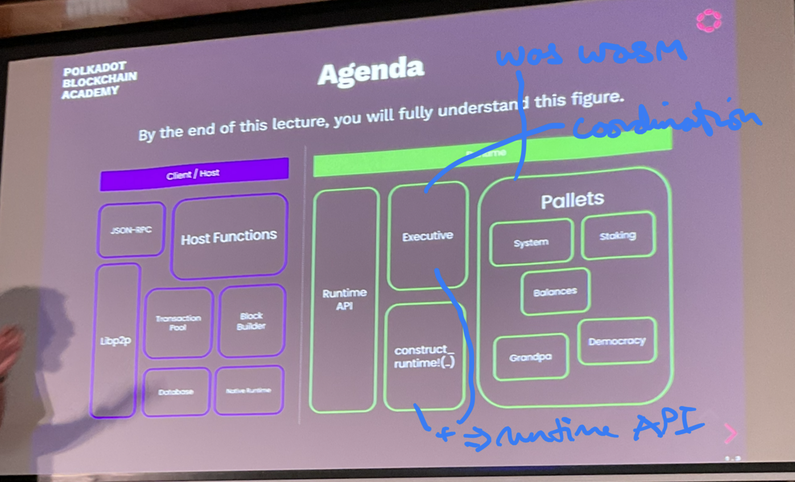

# FRAME



## Pallet

Isolated unit of business logic that executes within a runtime.

Contains:
- Dispatchable extrinsics
- Storage items
- Hooks for:
  - Block initialization
  - Finalising block (!= block finality i.e. GRANDPA)

Pallets also have:
- Events
- Errors
- Custom validation/communication with tx-pool
- Off-chain workers
- A lot more! But you will learn about that later.

## "Shell" Pallet

```rust
#[frame_support::pallet]
pub mod pallet {
  use frame_support::{pallet_prelude::*};
  use frame_system::pallet_prelude::*;

  // config trait
  #[pallet::config]
  trait Config: frame_system::Config {}

  // storage items
  #[pallet::storage]
  pub type X = ..
  #[pallet::storage]
  pub type Y = ..

  // dispatchables
  #[pallet::pallet]
  pub struct Pallet<T>(PhantomData<T>);
  #[pallet::call]
  impl<T: Config> Pallet<T> {
    fn tx_1(origin: OriginFor<T>, arg: u32) -> DispatchResult { .. }
    fn tx_2(origin: OriginFor<T>, arg: u64) -> DispatchResult { .. }
  }

  // hooks
  #[pallet::hooks]
  impl<T: Config> Hooks<BlockNumberFor<T>> for Pallet<T> {
    fn on_initialize() {}
    fn on_finalize() {}
  }

  // other stuff, events, errors, genesis configs, unsigned validation etc.
}
```

## Config Trait.

Gateway to recieve **stuff** from the outer world.

```rust
#[pallet::config]
trait Config: frame_system::Config {
  // An example of receiving an input type.
  type VAlueType: Into<u32> + Codec + Default;

  // An example of receiving a const.
  const MAX_VALUE: u32;

  //  A hook about what to do.
  fn on_value+update(new_value: Self::VAlueType);
}
```

Everyone has access to system's config.

## Storage Items

The (holy) **state** of your blockchain!

```rust
// T:AccountId comes from system, T::ValueType comes from use.
#[pallet::storage]
pub type Values<T: Config> = StorageMap<_, T::AccountId, T::ValueType>;

// A simpler storage item.
#[pallet::storage]
pub type Counter<T: Config> = StorageValue<_, u32>;
```

## Extrinsics

```rust
#[pallet::storage]
pub type Values<T: Config> = StorageMap<_, T::AccountId, T::ValueType>;
#[pallet::storage]
pub type Counter<T: Config> = StorageValue<_, u32>;

#[pallet:pallet]
pub struct Pallet<T>(PhantomData<T>);

#[pallet::call]
impl<T: Config> Pallet<T> {
  #[pallet::weight(0)]
  pub fn set_value(origin: OriginFor<T> , value: u32) -> DispatchResult {
    // checks the origin to be signed -- more on this later.
    let who = ensure_signed(origin)?;

    // checks that this user has not submitted already.
    if !<Values<T>>::contains_key(&who) {
      if value > T::MAX_VALUE.into() {
        return Err("failed".into());
      }

      // increment the counter
      Counter::<T>::mutate(|x| *x += 1);
      let value: T::ValueTYpe = value.into();
      <Values<T>>::insert(who, value);
      T::on_value_update(value);
    } else {
      return Err("already submitted".into());
    }

    Ok(())
  }
}
```

## Hooks

```rust
#[pallet::hooks]
impl<T: Config> Hooks<BlockNumberFor<T>> for Pallet<T> {
  ...
}
```

## Other notes

You can use this tool to expand macros to help understand them.

```bash
cargo expand > expanded.rs
```

## Expanding The Code

- Pallet implements the transaction as public functions
- Pallet implements Hooks, and some equivalents like OnInitialize


Make sure you understand why these 3 are the same!

```rust
let origin = ..;

Pallet::<t>::set_value(origin, 10)

Call::<T>::set_value(10).dispatch_bypass_filter(origin);
// rust expanded/full syntax, you have to pass self in
<Call<T> as UnfilteredDispatch>::dispatch_bypass_filter(Call::<T>::set_value(10), origin);
```

And thats about it! Now lets look at...

## The System Pallet

A container for common **types, functionality**, and opinionated **OS-style routines**.

- common types: `<T as frame_system::Config>::AccountId`.
- common functionality: `set_code, set_storage, remark`
  - A remark is some info that doesn't do anything but that put some info into the blockchain.
    - collective painting
    - proving you have a public key
- system-level functionality
  - extrinsic count/length/weight(gas)
  - what's the current block number?
  - events
  - runtime version, code update

## Config Trait: Common Types

```rust
#[pallet::config]
pub trait Config {
  // this is touched upon in the previous section:
  type AccountId;

  // these two will become relevant in executive part
  type Hash;
  type Header;

  // these are not, but should still be comprehensible.
  type Index; // used as account nonce type
  type BlockNumber;
}
```

## Storage Items: Accounting, Metering, Transient

```rust
#[pallet::storage]
pub(super) type AllExtrinsicsLen<T: Config> = StorageValue>_, u32>;

#[pallet::storage]
pub(super) type AllExtrinsicsWeight<T: Config> = StorageValue<_, ...>;

#[pallet::storage]
pub(super) type Number<T: Config> = StorageValue<_, T::BlockNumber, ValueQuery>;

#[pallet::storage]
pub(super) type ParentHash<T: Config> = StorageValue<_, T::Hash, ValueQuery>;
```

set before block execution, deleted in the beginning of the next block.

## 3. `construct_runteim!` and Runtime Amalgamator.

Now, let's look:

```rust
// if the std feature is not enabled, compile using no_std???
#![cfg_attr(not(feature = "std"), no_std)]

#[sp_version::runtime_version]
pub const VERSION: RuntimeVersion = Runtime\version { .. };

parameter_types! { .. }
impl frame_system::Config for Runtime { .. }

parameter_types! { .. }
impl pallet_xyz::Config for Runtime { .. }

parameter_types! { .. }
impl pallet_pqr::Config for Runtime { .. }

pub mod opaque { .. }

construct_runtime!(
  pub enum Runtime where
  Block = Block
  NodeBlock = opaque::Block,
  UncheckedExtrinsic = UncheckedExtrinsic
  { 
    System: frame_system,
    PalletXyz: pallet_xyz,
    PalletPqr: pallet_pqr,
  }
);

pub type Executive = frame_executive::Executive<_, _, _, ...>;

// this is the juicy part! all implementations seem to come from Executive!
impl runtime_apis! {
  impl sp_api::Core<Block> for Runtime P
  fn version() -> RuntimeVersion {
    VERSION
  }

  fn execute_block(block: Block) {
    Executive::execute_block(block)
  }

  fn initialize_block(header: &<Block as BlockT>::Header) {
    Executive::initialize_block(header)
  }

  ...
}
```

## 4. Executive

This part is somewhat optional at this point. Re-visit it later in a week to understand it all.

Executive struct.

### Expanding The Generic Types

```rust
impl<
  // System config, we know this now.
  System: frame_system::Config,
  Block: sp_runtime::traits::Block<Header = System::Header, Hash = System::Hash>,
  // ignore for now
  Context: Default,
  // Ignore for now.
  UnsignedValidator
  // something that has all the hooks.
  AllPalletsWithSystem: OnRuntimeUpgrade
    + OnInitialize<System::BLockNumber>
    + ...

> Executive<System, Block, Context, UnsignedValidator, AllPalletsWithSystem> 
```

## Recap

The outer call enum like the inner call enum, also implements dispatch.

It forwards the call into the appropriate inner call enum.

This is almost identical to the execute_block function psuedocode.

```rust
fn execute_block(block: Block) {
  // get some info from the block

  // initialize the block, including all the on-initialize hooks.
  // go to the impl and see how this is clearing previous TRANSIENT stuff

  // execute all extrinsics
  // at this point they are all UncheckedExtrinsics
    // go through Checkable where the signature is checked
    // then Applyable where actual .dispatch is called

  // execute some other hooks

  // finally checks roots
}
```

```rust
// here is where the Applyable dispatch happens
let res = self.function.dispatch()...
```
