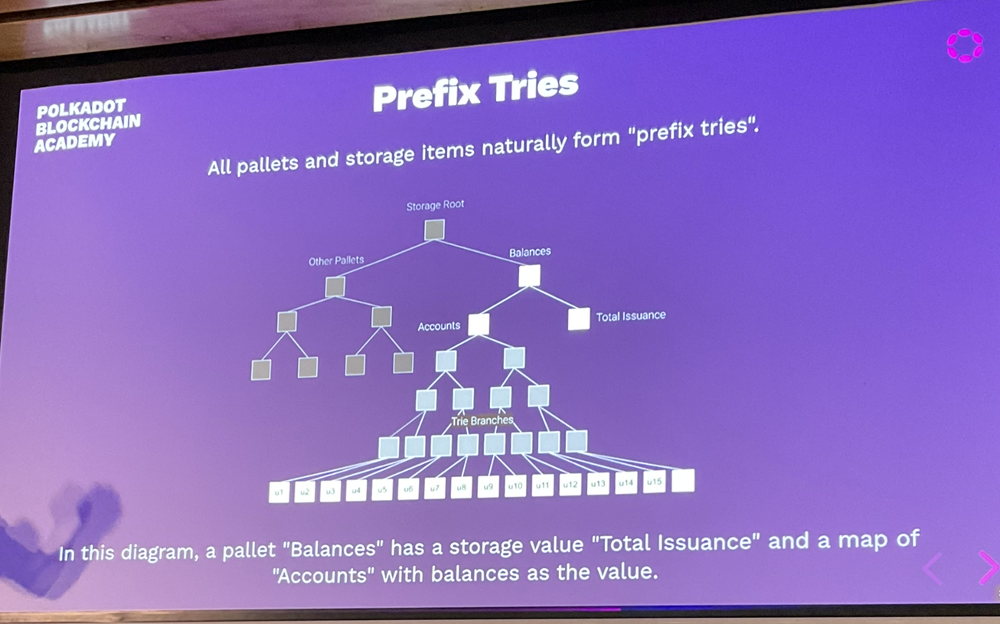

# FRAME storage

There are 4 main layers of storage in substrate

- runtime storage api
- storage overlays
- patricia-merkle trie
- key-value database

In FRAME we only use:

- runtime storage api
- storage overlays

## Overlay Change Set

### Verify First, Write Last

This was the rule for all of FRAME development.

```rust
fn give_balance_to_bob(who: &[u8]) -> Result<(), ()> {
  sp_io::storage::set(who, &100u32.encode());
  if who != b"bob" {
    // Too late to return an error, change is already made
    return Err(());
  }

  Ok(())
}

#[test]
fn verify_first_write_last() {
  sp_io::TestExternalities::new_empty()...
}
```

### Transaction Storage

- can spawn new transactional layers
- helps us to prevent stuff entering storage

### Storage Layer by Default

- Storage layer is now default.

## FRAME Storage Keys

we follow a simple pattern:
```rust
hash(name) + hash(name2) + ...
```

## Pallet Name

The pallet name comes from the `construct_runtime!`.

## FRAME Storage Primitives

- StorageValue
- StorageMap
- CountedStorageMap
- StorageDoubleMap
- StorageNMap

## StorageValue

Place a single item into the runtime storage

```rust
pub struct StorageValue<Prefix, Value, QueryKind = OptionQuery, OnEmpty = GetDefault>(_);
```

Storage Key:
```rust
Twox128(Prefix::pallet_prefix()) ++ Twox128(Prefix::STORAGE_PREFIX);
```

e.g.

```rust
#[pallet::storage]
pub type Item1<T> = StorageValue<_, u32>;
```

```rust
#[test]
fn storage_value() {
  sp_io::TestExternalitiies::new_empty().execute_with(|| {
    Item1::<T>::put(10u32);
  })
}
```
## Storage Value Key

```rust
use sp_core::hexdisplay::HexDisplay;
println!("{}", HexDisplay::from(...))
```

## All Storage is an Option

You either get `None` or`Some(value)`

However we can hide this a `Default` value.

## Query If Storage Actually Exists

```rust
exists()
```

## Query Kind

- `OptionQuery` - default choice, represents actual DB state
- `ValueQuery` - Return a `Default` value when `None`.

```rust
#[pallet::type_value]
pub fn MyDefault<T: Config>
Item2::<T>::get() // 42u32

// or you could without macro magic:

let value = Item1::<T>::try_get().unwrap_or(42u32);
```

## Set vs Put

- `pub fn set(val: QueryKind::Query)`
- `pub fn put<Arg: EncodeLike<Value>>(val: Arg)`

```rust
Item1::<T>::set(Some(42u32));
Item1::<T>::put(42u32);
```

Don't put the option as a storage value. This is an anti-pattern, because the database already responds with an Option.

```rust
Item1::<T>::exists(); // false
Item1::<T>::put(None::<u32>);
Item1::<T>::exists(); // true
```

## Unit Type Instead of Bool

Save bytes, use the unit type.

If nothing exists - false, if I put the unit value in there - true.

```rust
Item1::<T>::exists(); // false
Item1::<T>::put(());
Item1::<T>::exists(); // true
```

## Kill Storage

Remove items using `kill()` or `take()`

```rust
Item1::<T>::put(10u32);
Item1::<T>::kill();
Item1::<T>::exists(); // false
Item1::<T>::put(10u32);
let old_value = Item1::<T>::take();
Item1::<T>::exists(); // false
println!("{:?}", old_value); // Some(10u32)
```

## Mutate and Try Mutate

For Try Mutation, you only commit the value if you return `Ok(())`.

```rust
Item2::<T>::try_mutate(|x| -> Result<(), ()> {
  *x = *x / 2;
  if *x % 2 == 0 {
    Ok(())
  } else {
    Err(())
  }
})
```

## Vec Tricks

```rust
Item7::<T>::put(vec![0u8]);
Item7::<T>::append(1u8);
Item7::<T>::append(2u8);
```

## Bounded Storage

Blockchains have limited memory.

Every single storage item in FRAME should be bounded in size.

If you are building a solo chain, you don't really need to worry about bounded storage.

If you are building a parachain, you do need to worry about it.

## Bounded Vector

Created bounded version of Vec, BTreeSet and so on.

```rust
#[pallet::storage]
pub type Item8<T> = StorageValue<_, BoundedVec<u8, ConstU32<100>>, ValueQuery>

#[test]
fn bounded_vec() {
  sp_io::TestExternalities::new_empty().execute_with(|| {
    for i in 0u8..100u8 {
      Item8::<T>::try_append(i);
    }
    // Only supports at most 100 items
    assert_noop!(Item8::<T>::try_append(100), ());
  });
}
```

## Storage Map

Store items in storage as a key and value map.

The storage key for a map uses the hash of they key.

## Prefix Tries



This allows for Storage Iteration for anything that shares a common prefix.

## You can..

- Iterate all storage using the prefix `&[]`
- Iterate all storage for a pallet using `hash(pallet_name)`
- Iterate all balances of users using prefix `hash(balances) + hash(accounts)`

This is a FRAME thing.

## Opaque Storage Keys

We use transparent storage keys.

```rust
final_hash = hash(preimage) + preimage
```

Hence we can always extract the preimage.

## Better Balance Map

We should use `Blake2_128Concat`.

```rust
for i in 0u64..10u64 {
  Item10::...
}
```

## Which Hasher to Use

- Identity
  - No hashing at all
  - If the key is already an uncontrollable cryptographic has, you can use this
- Twox64Concat
  - Non-Cryptographic and Transparent Hash
  - If the key is simple and controlled by runtime (like an incremented count) this is good enough
- Blake2_128Concat
  - Cryptographic and Transparent Hash
  - Normally use this

## StorageDoubleMap and StorageNMap

Basically the same as StorageMap but with more keys.

## Map Iteration Complexity

- Extremely expensive for computational and storage proof resources
- Requires N trie reads which is really N * log(N) database reads.
- If you do do it, make sure it is bounded

## Remove All

Implemented on Storage Maps

```rust
pub fn remove_all(limit: Option<u32>) -> KillStorageResult
```

## Counted Storage Map

A wrapper around a StorageMap and a StorageValue<Value=u32> to keep track of how many items are in a mpa, without needing to iterate all the values.

```rust
pub struct CountedStorageMap<Prefix, Hasher, Key, Value, QueryKind = OptionQuery, OnEmpty = GetDefault...>
```

This is not free to use, it has additional overhead.

## Architecture Considerations

- Accessing very large items from the db is not efficient.
  - ParityDB optimised for items under 32kb.
  - Decoding is non-zero overhead.
- Accessing lots of storage items in a map is also very bad!
  - Lots of overhead constantly calling host functions
  - ...


