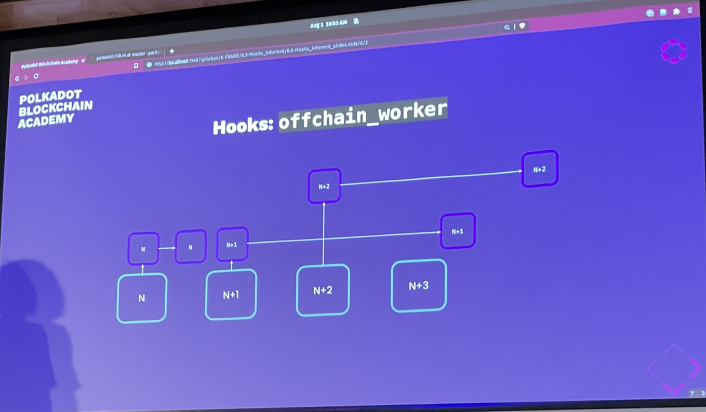

# Hooks

## `on_initialize`

- Useful for any kind of automatic operation.
- The weight you return is interpreted

- `Mandatory` Hooks should really be lightweight and predictable, with a bounded complexity.

```rust
fn on_initialize() -> Weight {
  // any user can create one entry in `MyMap` -> FOOT GUN!
  <MyMap<T>>::iter().for_each(do_stuff);
}
```

- Question: if you have 3 pallets, in which order are they called?
  - The order which you put them in there.
    - Apart from System which is always first
      - It actually has 2 on_initialize functions, 1 is always first, the other is in order
- Question: If your runtime panics on_initialize, how can you recover from it?
  - No block can be produced.
    - DON'T DO THIS!
- Question: If your hook consumes more than the maximum block weight?

## `on_finalize`

Its weight needs to be known in advance. Therefore, less preferred compared to `on_initialize`.

Similar to `on_initialize`, `on_finalize` is also **mandatory**. this is also why its weight is registered a the beginning of the block.

```
Generally, avoid using it unless something REALLY needs to be happening at the end of the block.
```

Sometimes, rather than thinking "at the end of block N", consider writing code "at the beginning of block N+1".

## `on_idle`

- **Optional** variant of `on_finalize`, also executed at the end of the block.

This hook won't be triggered if there is not enough weight available.
It is triggered with an argument of how much weight is available.

## `on_runtime_upgrade`

Called once per every time the that the runtime version changes, before anything else.

Your one and only chance to migrate the state if needed.

Has its own lecture.

## `offchain_worker`

Fully off-chain application:

- Read chain state via RPC.
- submit desired side effects back to the chain as transactions

Runtime off-chain worker:
- Code lives onchain, upgradable only in synchrony with the whole runtime
- Ergonomic and fast state access
- State writes are ignored
- Can submit transactions back to the chain as well



Called per block **IMPORTANT** (!= sync)

Off-chain workers have their own **special host functions**.

## `integrity_test`

Called upon `construct_runtime!` only.

Best to make sure all the inputs coming into your pallet as `type Foo: Get<u32> = ..` are sensible!

```
Panic, panic all you want in here.
```

```rust
fn integrity_test() {
  asset!(
    T::MaxPointsToBalance::get() > 0,
    "Minimum points to balance ratio must be greater than 0"
  );
}
```

This allows you to run tests to ensure the config is suitable.

## Hooks: Others

There are all the `#[pallet::hooks]` that you can have.

### `genesis_build`

```rust
// in your pallet
#[pallet::genesis_config]
pub struct GenesisConfig<T: Config> {
  pub max_pools: Option<u32>,
  pub max_members: Option<u32>,
}

#[cfg(feature = "std")]
impl <T: Config> Default for GenesisConfig<T> {
  fn default() -> Self {
    Self {
      max_pools: Some(16),
      max_members: Some(16 * 32),
    }
  }
}

#[pallet::genesis_build]
impl<T: Config> GenesisBuild<T> for GenesisConfig<T> {
  fn build(&self) {
    // self.max_pools & self.max_memebrs
  }
}

// Somewhere in the client, while building a chain spec:
NominationPoolsConfig {
  max_pools: 42,
  max_members: 24,
}
// This will then be put into your JSON/raw chain-spec
```

Each pallet can define a `struct GenesisConfig` -> `<PalletName>Config`

## Recap


- Question: Where/when is the offchain worker called?
  - Anywhere/nowhere. It is optional. But it gets collated towards the end.
  - It is not part of the consensus code and it technically be triggered whenever you want.
